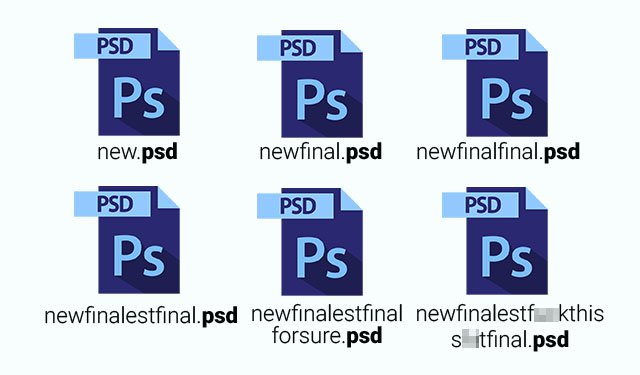
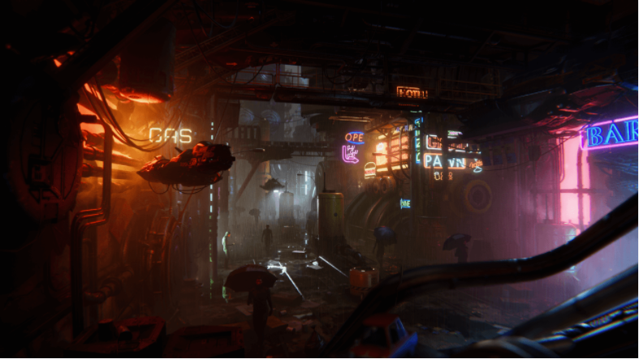

# Project Resources
{:.no_toc}

## Table of contents
{: .no_toc .text-delta }

- TOC
{:toc}

---

*This page contains a list of guides, tips, resources, and other helpful things that might be useful for the final project.*

# Project Workflow

As you are working in groups, you'll have to establish some sort of workflow that lets everyone work efficiently. Do not be the group that shares various versions of the project through google drive or usb (trust me, we've been there).

## Version Control 

Using version control with Unity isn't exactly the same as using it for a "regular" cs project, since you have to deal with Unity's binary files and invisible .meta files. But you have a couple options.

1. **Plain old Git (& Github)**. Unity works well for the most part with regular git procedure (for those unfamiliar with git, [**here's**](https://try.github.io/) a cool tutorial). There are special things you'll want to keep in mind, described in [this article](https://robots.thoughtbot.com/how-to-git-with-unity). We've listed some of them below:
   - Use the Unity [.gitignore](https://github.com/github/gitignore/blob/master/Unity.gitignore). This will avoid most unnecessary files (which are generated by your computer while you use a project) from getting pushed onto your repository. Keep in mind that the .gitignore assumes that the repository root is also the project root (the folder that contains the Assets folder)
   - Have only one person be editing a particular scene at a time. Scene files don't play nicely with merges.
   - Watch out for large (>50mb) files. If they get too large you'll have to setup [Git LFS](https://git-lfs.github.com/) to support the project.
   - You can use tools like [Github Desktop](https://desktop.github.com/) or [GitKraken](https://www.gitkraken.com/) if you don't like using the command line.
2. Unity Teams/Unity Plastic/Unity Collab/Whatever they're calling it now
   - no don't use this

# Tutorials

[**Tutorial Using Unity's XR Interaction Toolkit**](https://learn.unity.com/course/create-with-vr)

(Below tutorials are only for Oculus headsets and are a little outdated.)

[Tutorial Using the Oculus SDK](http://www.rgbschemes.com/blog/oculus-touch-and-finger-stuff-part-1/): See the first couple paragraphs of this tutorial to learn how setup a new Oculus Project.

## Quick Oculus Project Setup

1. **Mark project as VR ready**. Go to *Edit > Project Settings > Player* and check the box that enables VR support.
2. **Download Oculus Integration from the** [**Unity Asset Store**](https:/../assetstore.unity.com/packages/tools/integration/oculus-integration-82022). This is a comprehensive bundle with all of Oculus' side add-ons.
3. **Replace the Main Camera with the OVRCameraRig prefab**. We recommend using the search bar to find the OVRCameraRig prefab. This prefab represents your VR setup.
4. **Add in the LocalAvatar prefab**. This prefab gives support to the first-person control scheme (e.g. Touch controllers).

Note that the setup process will be different if you use a virtual reality framework like VRTK.

# Resources

There are a lot of resources out there for you to take advantage of, many of them cheap or free. Don't feel the need to reinvent the wheel - every hour saved by an SDK or assetpackage is an hour you can spend further prototyping your application.

1. [**Oculus Developer Center**](https://developer.oculus.com/downloads/unity/). The Unity Asset Store package should be sufficient for development purposes, but in the case you need newer versions or specific utilities, you can visit this site to download them. Some things you'll find there:
   - Oculus Utilities is the package you'll need to start building for Oculus.
   - Oculus Avatar is used for social presence (hand models and interaction)
   - Oculus Platform is used for multiplayer applications (room management, voice chat)
   - Audio packages for ambisonics and 3D sound
   - Code snippets and demos 
2. [**Unity Asset Store**](https://www.assetstore.unity3d.com/en/). The asset store is a marketplace for people to buy and sell all sorts of Unity assets: script packages, 3D models, 2D art, music, complete games, etc. There is a ton of content here, and a lot of it can be adapted to serve your needs. The picture above, for instance, was built entirely with [**store assets**](https://blogs.unity3d.com/2017/10/04/neon/).
3. [**VRTK**](https://vrtoolkit.readme.io/). The Virtual Reality Toolkit is a framework that implements a lot of common features in VR applications, including methods of locomotion, object grabbing/throwing, and controller interactions.
4. [**NewtonVR**](http://www.newtonvr.com/). This is also a VR framework, but one that focuses on object interactions and the physics behind it. It does less than VRTK, but because of it can be less restricting to use.
5. [**DevAssets**](http://devassets.com/). This site holds a lot of professional level 3D models../assets. It follows the old humble bundle approach: you pay what you want (including $0). Great for quick prototyping while still maintaining visual polish.
6. [**Photon**](https://www.photonengine.com/). This is a multiplayer networking framework that builds on top of [**Unity's own networking API**](https://docs-multiplayer.unity3d.com/) (which is also perfectly usable). It supports their Photon Cloud service, which allows you to have up to 20 concurrent users on their dedicated servers, for free.
7. [**Poly**](https://poly.google.com/). Poly is the content distribution platform for Google's Blocks, a 3D modeling VR application. This is an incredible resource for well-regulated, decent quality, low-poly assets, and a lot of them come under a Creative Commons license!
8. [**Unity's Create with VR Tutorial**](https://learn.unity.com/course/create-with-vr). There are also instructions here to set up a VR simulator so you don't have to test things with the VR headset. Instructions are in: 1 - VR Basics -> 1.1 VR Project Setup -> 4 Run the app with the device simulator.
9. [**Jacobs Hall headset checkout**](https://jacobsinstitute.berkeley.edu/oculus-check-out/). You can checkout Oculus Quest 2s for two weeks at a time from Jacob's Hall. Pickup and drop-off are weekdays 11am-1pm.