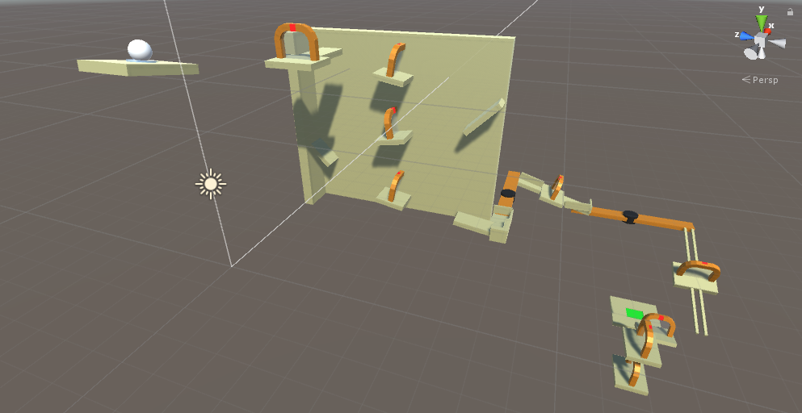
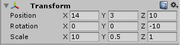
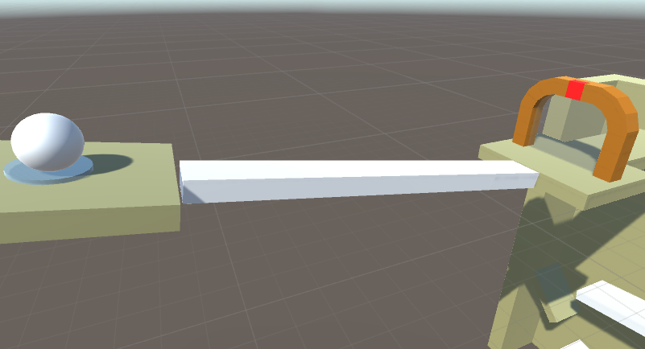
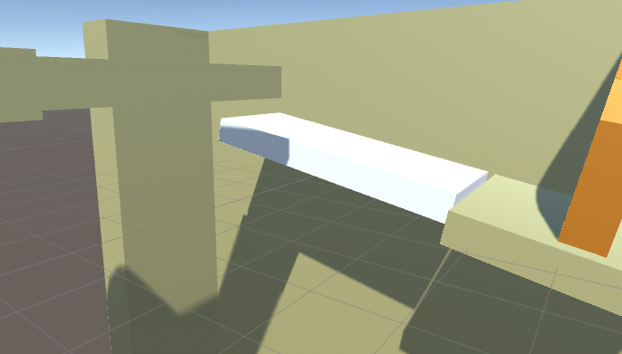
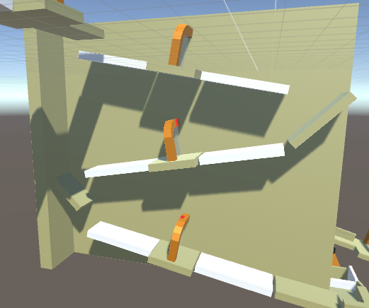
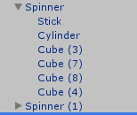
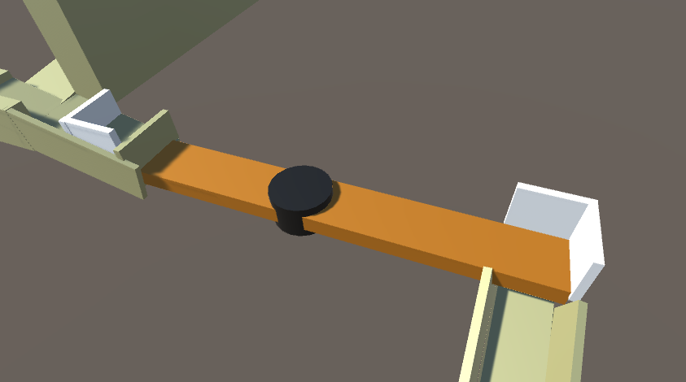
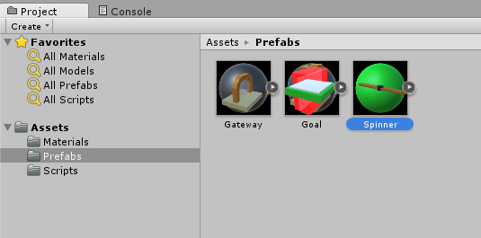

# Homework 1: The Rube Goldberg Ball Machine
{:.no_toc}

## Table of contents
{: .no_toc .text-delta }

- TOC
{:toc}

---

Your first assignment is to create a [Rube Goldberg Ball machine](https://www.youtube.com/watch?v=9gIUnHYpW3E). This will be mainly an exercise in getting familiar with the controls and tools that Unity provides, so for those with prior Unity experience, a lot of it will be review. Just a reminder that the Unity Version we want to use is 2021.3.*. This is the version we tested the homework on; we cannot guarantee it works for other versions of Unity. First download Unity Hub, then you can download specific versions of Unity here: [https://unity3d.com/get-unity/download/archive](https://unity3d.com/get-unity/download/archive). Click the "Unity Hub" option.

# Getting Started

Start off by downloading the skeleton asset package [**here**](https://drive.google.com/file/d/1cA92AKR_QQxPaHDqYh5sldioD2GBRpcg/view?usp=sharing), and then open up a new Unity project. Import the downloaded package into your project through *Assets > Import Package > Custom Package*. You’ll see some folders that contain the assets needed for this assignment.

Double-click the HW1 scene to get started. As a reminder, you can navigate the scene view by holding down the right mouse button and using WASD + QE to fly around. Your starting scene should look like this:

Note in particular the white ball, the 9 gates, and the green square. **You may not move any of the objects already in the scene.**

Try pressing the play button at the top of the editor. Your ball should roll off the platform and fall indefinitely. Your task for this assignment is to add and modify the scene such that when you press the play button, **the ball rolls through all 9 gates and lands on the green square.**

As long as you follow the rules above, you may skip the next two sections and instead complete the assignment in any way you wish.

# Gate 1

Let’s start by connecting the starting platform with the first gate. Right click an empty spot within the hierarchy view and select *3D Object > Cube* to create a cube. Select it, then within the Inspector view modify its transform component so that it forms a ramp from the first platform to the gate. For convenience, here are the transform values we used:

Your scene should then look like this:

Now click play. Our ball now makes it through the first gate!

# Gates 2-4

Create another cube. Transform and place it so it acts as another ramp: the ball should will roll off the first gate, land on the ramp and roll into the second gate. It should look like this:

We suggest transforming the cube using the position (w), rotate (e), and scale (r) tools, instead of directly modifying the transform component values. These tools can also be selected in the top left of the screen.

After doing this, take a look at the whole wall. You can see that the ball is supposed to roll in a zig-zag platform that moves it through the three gates and onto the next platform. This will require 5 more ramps like the one you just created.

For the remaining 5 ramps, try using the duplicate tool instead of re-transforming a new cube each time. Select the ramp you just made and use ctrl + d to duplicate it, then modify it from there. The result should look like this: 

Tip: you can duplicate multiple objects at once by holding shift while selecting them.

# Gate 5

After completing the wall, you’ll notice the ball is supposed to get onto a spinning platform to make it to the other side. However, the spinner is flat - there’s nothing to catch the ball with as it spins. We’ll attach railings to the spinner to remedy this.

Before this, however, we need understand parenting. Parenting is where we define an object’s transform to be relative to that of a different object in the scene.

For instance, the cubes we’ve been placing in the scene thus far have no parents. Their transforms are relative to the world space, which never moves. But if we were to parent one of these cubes under another, the child’s transform would then be relative to its parent instead. More importantly, if the parent moves, the child moves with it (since it must maintain its relative positioning to its parent). Parenting is an essential tool for both creating complex structures and keeping your project organized. You can do it by dragging one object in the Hierarchy tab onto another.

Place cubes as the picture below shows around the spinner to catch the ball during the spin. Make sure these cubes are parented under the Spinner object in the hierarchy. You'll want to make the walls thick to make sure the ball doesn't glitch through the walls when the spinner moves.

**Warning: Unity's default physics are non-deterministic and somewhat glitchy. You may need to finesse parts of the scene to make things work, such as making the walls thicker, adjusting the speed of the spinner (check out the script attached to it), or adding more guide-rails.**

Tip: it might be hard to see how far the spinner extends, as it clips into the other blocks on the left. To remedy this, select the blocks obstructing your view and click the checkmark near the top of the Inspector view. This will disable them temporarily and allow you to work better. Just remember to enable them again when you’re done!

You might notice that while testing, the physics interaction between your ball and the railings you place don’t look right. To help remedy this, for each of your 4 railings, go to the inspector panel and add a Rigidbody component. This will tell Unity to treat them as proper moving physical objects. You’ll also want to uncheck gravity so they don’t drop when you start the game, and check Is Kinematic, which tells Unity that you only want to move these objects via script or animation (which we do).

# Gate 6

For the next section, we want to complete another spinner to push the ball into the railings. We could duplicate we made on the original spinner, but we’ll do it a different way: with prefabs.

Prefabs are Unity’s way of storing GameObjects for future use. With a prefab, you can take a complex object you’ve created and store it outside of the scene itself. This lets you easily bring it into the same scene, a different scene, or a different project entirely. Prefabs also give a couple of useful utilities, which we will now explore.

In your Project tab, go into the prefabs folder and look for an object called Spinner. The two spinners in our scene are instances of this prefab.

Now select the Spinner you just modified in your hierarchy. Notice the three buttons near the top next to the word “Prefab”: Select, Revert, and Apply. These buttons do the following:

- “Select” will dig into your Project tab and select the prefab your object is using, just like the image above. This can save a lot of time in large projects.

- Overrides > “Revert All” will change your selected instance of a prefab you’ve selected to a clone of the prefab itself. Useful for undoing your work.

- Overrides > “Apply All” will save your selected instance to the prefab in the Project view. The opposite of reverting.

- "Open" will open the prefab editor to allow for more fine grained changes.

For our purposes, since we’ve added railings to an instance of the Spinner prefab, we want to apply those changes to the prefab itself. Click “Apply” to do so. Notice that when you did so, not only did the prefab in the Project view change, but also the second Spinner in the scene - thus saving you some work.

If you test it now, your ball should make it onto the railings and through the 6th gate.

# Gate 7-9

This marks the end of the guided section! There are a couple more gates before the goal - put in whatever you want to complete the Rube Goldberg machine!

A tip: Don’t be scared to add additional railings or walls to the course. Unity’s physics aren’t perfect and small changes to your ramps can lead to different behaviors down the line, so it’s better to be safe than sorry.

# Submission and Grading

For this and all future homework (except homework 2), submissions will be done through WebGL builds. If you don't have the WebGL module, go to the *Installs* tab in the Unity Hub. On the upper right of the version, click *Add Modules*. Here, add "WebGL Build Support".

Next, we need to disable compression because simmer.io can only process uncompressed builds. To do this, **File > Build Settings > Player Settings** (bottom right of build menu) > **Publishing Settings** > **Disable "Compression Format"** ([*Video*](https://www.youtube.com/watch?v=2jjESP58jsA))

To create a build of your project, go to *File > Build Settings*. Make sure the scene is selected, then click *Build* to create a WebGL build. You can submit your build on bCourses with a [simmer.io link](https://docs.google.com/document/d/1dq9Nix39YqwBiCpnAIGKzl2-2BTpJ4da5Q0OOQ1rgsE/edit?usp=sharing).

For grading, we will test your simmer.io project. We will run it up to 5 times - if the ball goes through all 9 gates and hits the green square to get the “You Win” message, you'll receive full points. Otherwise we will give partial credit for effort made.