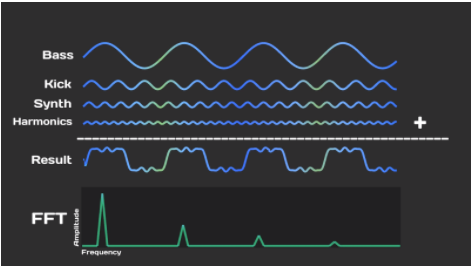
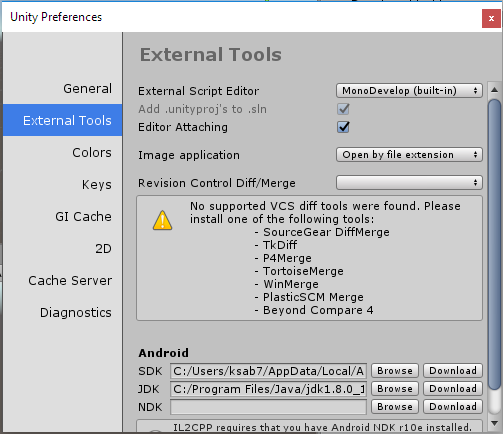
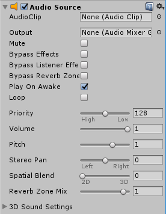
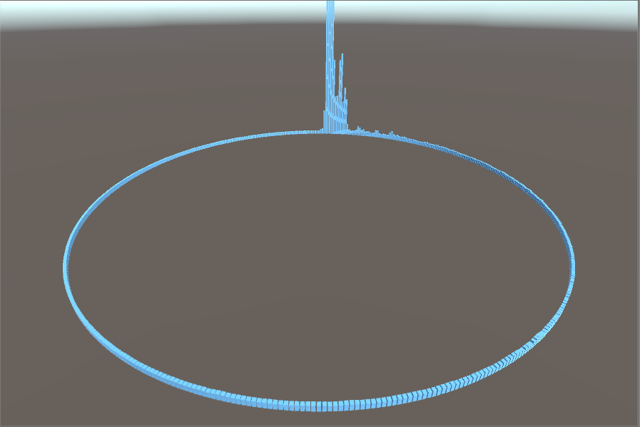
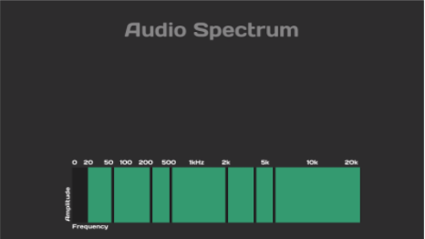
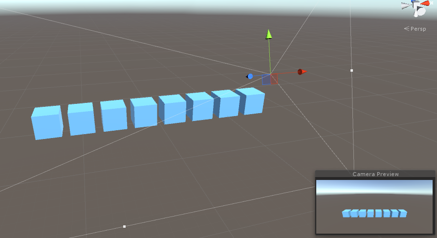
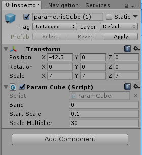

# Homework 2: Music Visualizer
{:.no_toc}

## Table of contents
{: .no_toc .text-delta }

- TOC
{:toc}

---

Your second assignment is to create your very own music visualizer! It will look something like this:

This assignment will be a review of some of the Unity editor tools you have practiced in HW1, but more importantly, an introduction on using C# scripts to manipulate gameobjects.

First off, download the skeleton asset package [**here**](https://drive.google.com/file/d/1qcFEAebMHNdoy75RfwDyPCGzI1t7l23H/view?usp=sharing) and import it into a new project. Create a new scene called HW2 to work in.

In the meantime, take a look at these amazing music visualizer examples created with Unity by other people. This homework only goes over the basics, but you could take it to another level by adding your own flair. Links: [1](https://www.youtube.com/watch?v=tMzmHWekLaY), [2](https://www.youtube.com/watch?v=cBYx8Dm81tc), [3](https://www.youtube.com/watch?v=80tu2ZLKD-o), [4](https://www.youtube.com/watch?v=XbNhv2ylzKw), [5](https://www.youtube.com/watch?v=swb-8Azjz9Q).

# Walkthrough Video
Here is a walkthrough of this homework. Feel free to use it to assist you:
[Walkthrough Video](https://www.youtube.com/watch?v=4Av788P9stk&list=PL3POsQzaCw53p2tA6AWf7_AWgplskR0Vo&index=2).
# Introducing Spectrum Theory

Every sound that enters your ear is actually a sum of different frequencies. Pure waveforms from various sources combine together into a single complex waveform. This complex waveform is then processed by your brain to create music, conversation, and everything else you hear.

The [**Fast Fourier Transform**](https://en.wikipedia.org/wiki/Fast_Fourier_transform) algorithm is the exact reverse - it takes a complex waveform and decomposes it into its base frequencies. Take the picture below as an example, which looks at a simple song from various perspectives.

What you physically hear is the result, which is the sum of the pure bass, kick, synth, and harmonics waveforms.

Performing FFT on the result returns an array of weights, which represent how much of each base frequency is being used in the result. You’ll notice there are 4 peaks, one for each of the pure waveforms. The leftmost peak represents the lowest frequency (the bass), and is the tallest because the bass has the greatest amplitude out of the four waveforms.

You might have noticed the FFT graph looks a little bit like a music visualization - and in fact it is. Music visualizations are nothing more than visual representations of the FFT for a song and how it changes over time. In our case, we will be representing the values of the FFT with the heights of various cubes.

*If you’d like to learn more, EE16A covers this subject in much more detail.*

# Extracting Spectrum Data

Let’s start off the homework by creating a script that allows you to extract spectrum data from any audio source.

We will start by creating an empty gameobject named “SpectrumAnalyzer” and a C# script named “SpectrumAnalyzer”. Add both an Audio Source and the script to the gameobject. Then open the script in the text editor of your choice, which will likely be Visual Studio or Monodevelop.

As a side tangent, you may change your script editor by going to *Edit > Preferences > External Tools*.

Start off by adding two variables to the script, above the Start() function.

    AudioSource audioSource;
    public static float[] samples = new float[512];

As you remember from roll-a-ball, the Start() function is called once, when the script is enabled. This makes it a good place to instantiate and/or initialize variables. We’ll initialize our audio source component here. Additionally, stub in a new function called GetSpectrumAudioSource().

    void Start () {
        audioSource = GetComponent<AudioSource>();
    }

    void GetSpectrumAudioSource() {

    }

We’ll use this function to analyze the spectrum data from audioSource and save it in variable samples every frame. Fortunately, Unity has a built in function that does this for us, [GetSpectrumData](https://docs.unity3d.com/ScriptReference/AudioSource.GetSpectrumData.html). We’ll use channel 0 since we’re only playing one thing at a time, and use Blackman for our spectrum analysis window due to its overall robust behaviour.

    void GetSpectrumAudioSource() {
        audioSource.GetSpectrumData(samples, 0, FFTWindow.Blackman);
    }

Since we’ll want to update our spectrum samples every frame, put GetSpectrumAudioSource() in the Update function.

    void Update () {
        GetSpectrumAudioSource();
    }

Save your work and switch back to Unity. Select your SpectrumAnalyzer gameobject and set the AudioClip to whichever audio file you want to visualize. We have provided a sample audiofile in the Audio folder, in case you don’t have any. Here are some links to music if you’d like to download some: [1](https://www.bensound.com/), [2](http://www.purple-planet.com/), [3](http://freemusicarchive.org/), [4](https://soundcloud.com/royalty-free-audio-loops).

# Visualizing Spectrum Data

Next, we’re going to visualize each of the 512 spectrum samples using cubes.

In *Assets > Scripts*, find and open the script “Instantiate512cubes”. This script starts off by spawning 512 cubes in a circle such that they all face the center. It then takes the sample data every frame and represents it using the heights of the cubes. The effect will be something like this:

There are two sections of this script for you to complete on your own. Read the comments for more details on what each section does and hints on how to do it.

When you’re done, save your work and switch back to Unity. Create a gameobject called “InstantiateCubes” and attach the script to this object. You’ll notice the Cube Prefab isn’t assigned - you can find a prefab for it in *Assets > Prefabs*.

Press play! You’ll notice that the camera location isn’t great. Change the position and rotation so that the camera is showing the scene correctly. Remember that while you can edit anything while the game is playing by switching back to the scene view, none of it will save once the game stops playing.

To work around this, move your camera to where you want it, then click the gear icon in the transform component’s top right to copy component. Then stop play mode (which will move your camera back), click the gear, and paste the component values you just copied.

Congrats! You now have a working music visualizer.

# Introducing Frequency Bands

After testing out your visualizer, you might have noticed that most of the movement happens in the first couple cubes (the lower frequencies) while most of the other cubes (higher frequencies) barely move.

The reason for this is that the lower frequency sounds are much closer together, while the higher frequencies are much more spread out. This means all the low frequencies get shoved into a couple of cubes, while the high frequencies are spread out across a whole bunch of them.

We’re now going to fix this issue by collating the 512 samples into just 8 bins, which will represent different frequency bands. Audio specialists have grouped the range of human detectable frequencies into 7 broad regions. They are as follows:

1. Sub Bass: 20 - 60 Hz
2. Bass: 60 - 250 Hz
3. Low Midrange: 250 - 500 Hz
4. Midrange: 500 - 2k Hz
5. Upper Midrange: 2k - 4k Hz
6. Presence: 4k - 6k Hz
7. Brilliance: 6k-  20k Hz

Notice how the regions roughly increase in size as they increase in frequency. Inspired by this, we’ll create 8 bins where higher frequency bins absorb more samples. We have a total range of 20k - 20 = 19980 Hz to cover, and with 512 samples each sample covers 19980 / 512 = 39 Hz. We’ll define the bins as follows:

| bin index | # samples used | hertz range | range size |
| --- | --- | --- | --- |
| 0 | 2 | 20 - 98 | 78 |
|1 | 4 |	99 - 225 |	156|
|2	|8	|256 - 568|	312|
|3	|16	|569 - 1193	|624|
|4	|32	|1194 - 2442|	1248|
|5	|64	|2443 - 4939	|2496|
|6	|128	|4940 - 9932	|4992|
|7	|258*	|9933 - 19995	|10062|

**We stick the two last samples into the final bin, hence why it’s 258 and not 256.*

# 8 Bin Separation
Switch to editing SpectrumAnalyzer. Add a variable for array freqBand, which will contain the collated sample data bins. Also add a function called MakeFrequencyBands(). As filling out this function is rather tedious, we’ve done it for you.

    public static float[] freqBand = new float[8];

    void MakeFrequencyBands() {
        int count = 0;
        
        // Iterate through the 8 bins.
        for (int i = 0; i < 8; i++)  {
            float average = 0;
            int sampleCount = (int)Mathf.Pow (2, i + 1);

            // Adding the remaining two samples into the last bin.
            if (i == 7) {
                sampleCount += 2;
            }

            // Go through the number of samples for each bin, add the data to the average
            for (int j = 0; j < sampleCount; j++) {
                average += samples [count];
                count++;
            }

            // Divide to create the average, and scale it appropriately.
            average /= count;
            freqBand[i] = (i+1) * 100 * average;
        }
    }

Add a call to MakeFrequencyBands() to Update() so it gets called every frame.

If you ran and debugged this updated script now, you’d find that the value range for each bin vary greatly. To make it easier to work with the values, we’ll scale each bin’s value into a number between 0 and 1.

Add the following variables and function to SpectrumAnalyzer.

    float[] freqBandHighest = new float[8];
    public static float[] audioBands = new float[8];

    void CreateAudioBands() {

    }

Fill out CreateAudioBands() on your own. This function should first update freqBandHighest, which contains the highest-yet-seen values for each bin. Then it divides each current band value by the highest-yet-seen to get us a number between 0 and 1. This result is saved to array audioBands.

Once you've completed CreateAudioBands(), add it to the end of Update() so it gets called each frame.

# Visualizing 8 Bins

Finally, let’s create cubes to visualize the calculated values for each bin.

Let’s use the cube prefab again, and place eight of them in the middle of the scene. You can simply drag the prefab into the Hierarchy or the scene view. Scale them so they’re visible in the game view.

We’ll need a script to read the values from audioBands in SpectrumAnalyzer and represent them as heights for each cube. Create a C# script named “Cube”, and add the following variables to it:

    public int band;
    public float startScale;
    public float scaleMultiplier;

The variable band represents which bin this cube represents. startScale represents the height of the cube when its audioBand value is 0, and scaleMultiplier is how much to multiply the audioBand value by.

Fill out the needed functionality on your own. You can refer to Instantiate512cube for help, since the functionality is similar. When you’re done, attach the script to each of the cubes and set the editor values appropriately (remember, you can modify multiple objects at once via shift/ctrl select). You do not have to use the values shown below.

Now try out your music visualizer!

# Add Your Own Flair

Your final task is to add your own feature to the music visualizer. This is completely open-ended - you may go as crazy as you’d like. We only request that you do not remove the functionality you’ve implemented thus far.

Here are some suggestions on what you could add:

- [Lights](https://docs.unity3d.com/ScriptReference/Light.html)
- [Colors](https://docs.unity3d.com/ScriptReference/Material.html)
- Different Kinds of Visualization (spheres, rotation, etc.)
- Band Buffering (removing the choppy movement of the bands)

# Submission and Grading

Upload the project via Google Drive and submit the link to a google form on the resources page on Ed. Completion of the functionality described in this homework will get you 4 points (out of 5), and adding your own improvements will get you the last point. There will be extra credit given to those whom we deemed went above and beyond with their improvements.

## Credits
{:.no_toc}
This assignment was taken and adapted from Peter Olthof’s brilliant music visualizer tutorial on Youtube. You can find it on his channel, [Peer Play](https://www.youtube.com/channel/UCBkub2TsbCFIfdhuxRr2Lrw).