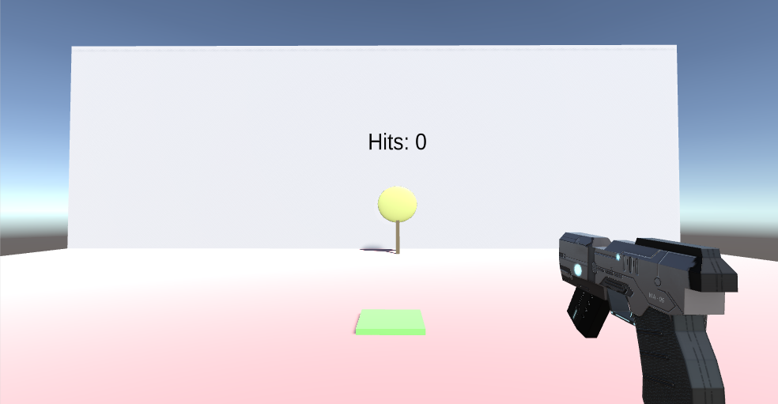
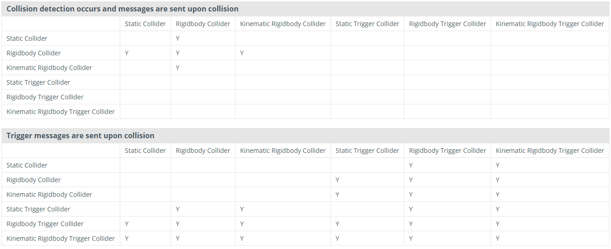
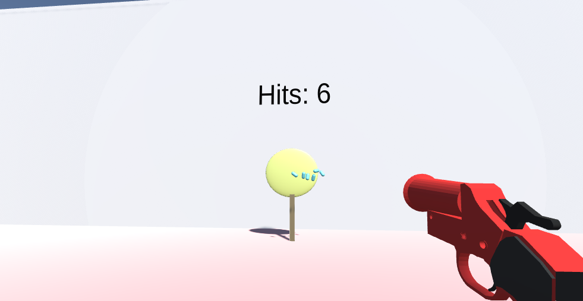
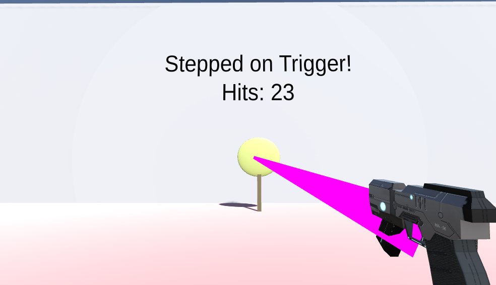

# Homework 5: Collisions, Raycasting, and Triggers
{:.no_toc}

## Table of contents
{: .no_toc .text-delta }

- TOC
{:toc}

---

While the previous homework was very open-ended, this homework has slightly more structure in order to help you get ready for developing your own final project. This homework focuses on collisions, raycasting, and triggers which are staples of user-world interaction in Unity. 

You'll be building the functionality of two different guns: one of which is the flare gun which will rely on Unity physics and collisions, and the other is the laser gun which will use raycasting to detect its target. You will also make a pressure plate that detects when the user has stepped on it using triggers. This homework is split into two parts.

You can download the skeleton project [**here**](https://drive.google.com/open?id=1R59r77jqtPv-28q-KRDHP9Ca2Hi24oYd).

# Overview

While the labs have taken you through some of this work already, most of this homework is implementation from the ground up. We don't expect you to know everything from the start to complete this homework; rather we'd like for you to search online for how some of these things work. Results from stackoverflow, the Unity forums, and Reddit are usually helpful. Searching things like "how to detect object collision unity" is bound to give you pertinent results. It's important to get used to this since it's very helpful for the final project, as well as any independent projects you may do later on.

When you're done with both parts of the homework, you should have:

1. A flare gun that fires a flare bullet with working sound, and increments the target text counter when a bullet hits the target.
2. A laser gun that fires a ray with working sounds, and increments, the target text counter when the ray hits the target.
3. A pressure plate that displays the "Stepped on Trigger!" message on the wall when stepped on.

You may find this chart helpful:

You can learn more here: [https://docs.unity3d.com/Manual/CollidersOverview.html](https://docs.unity3d.com/Manual/CollidersOverview.html)

# Part 1

## The Scene

When you load the SampleScene given in the package, you will notice that there are two floating gun models, a target with a text counter over it, and a green square on the ground. Your task for the first part will be to implement the firing and hit detection mechanics for the flare gun and the target.

Moving and turning have already been implemented for you, with **WASD** controlling movement and your mouse controlling rotation. **Press Q** to switch between the two guns. Some advanced movement options are holding the shift key while moving to sprint and pressing the spacebar to jump. They use key bindings in Project Settings>Input. Before you can use these built in controls, go to Edit>Project Settings>Input and change the size under axes to 20. This will allow  you to create two new Input bindings. Name one **SwapGuns** and set the Positive Button to q. Name the other **FireGun** and set the Positive Button to mouse 0. Our controls implementation relies on these Inputs so make sure you do this or else shooting and swapping guns won't work. If you're curious or want to change the movement scripting, you can find the source code in Assets/Standard Assets/Characters/FirstPersonCharacter/Scripts.

## The Scene

Your job is to make the flare gun fire a visible projectile (a flare bullet) which is another GameObject. Unity physics will act on the flare to give it velocity and collisions with the world. When the flare hits the target, the target's onHit() method should be called which will increment the scoreboard (this functionality has already been implemented for you as well). 

The models and controls are already setup for you, so your job is to handle all the scripting. The flare gun and the flare are separate entities and have their own scripts, so make sure you are separating their functions. For example, does the flare fun need to know anything about the target? Probably not, since the flare bullet will be what actually collides with and interacts with the target. Take a look at **FlareGunFiring.cs** and **FlareBullet.cs** for details in the code comments. Like the monster in the lab, remember to put a tag on the target! Feel free to mess around with the effects and sounds.

Once you have the flare gun shooting and flare bullets and incrementing the hit counter, you have finished part 1!

# Part 2

## The Laser Gun

Instead of a projectile, the laser gun should fire a visible (or can be invisible) "ray" from the gun model which shoots out in a straight line and is unaffected by physics. Like the flare bullet, the laser gun should also call the target's onHit() method when the ray hits the target. Look in **LaserGunFiring.cs** for an overview. The visuals of this ray are already created for you, but the mechanics are not. You should be editing the fireLaserGun() method.

## Pressure Plate

For this part, you will write the code in **StepTriggerScript.cs** to call the steppedOnTrigger() method (already made for you) when the player steps on the green pad. Refer to the collision chart to decide which colliders will work for this. You will need to make a new method for this functionality. 

If you have the laser gun shooting and updating the target's hit counter correctly, and the green pressure plate displaying 'Stepped on Trigger!', you have finished part 2.

# Submission and Grading

Use simmer.io to submit your work to bCourses.