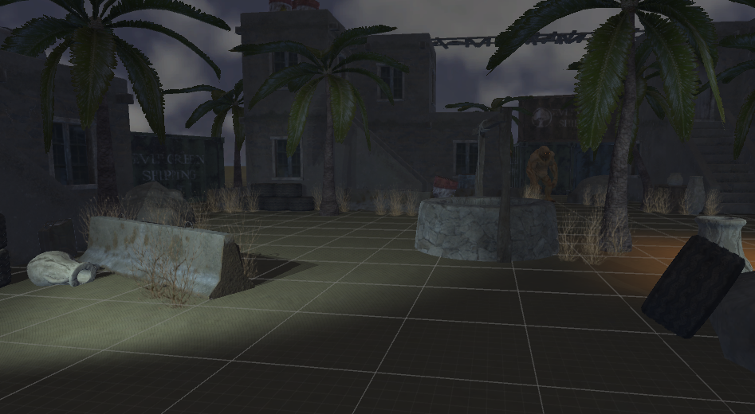

# AR Foundation Lab 1: Project Setup / Building the Environment
{:.no_toc}

## Table of contents
{: .no_toc .text-delta }

- TOC
{:toc}

---

Welcome to Monster Shooter! Over the course of these labs, you’ll be building a game that looks something like this:

These labs will not be a comprehensive overview of everything that Unity and AR has to offer. However, they will touch upon a lot of different topics so that you get a taste of what is possible. The labs will also serve as practice for creating a project from start to finish, something that will be valuable for the final project.

# The Game

Monster Shooter is a survival shooter game. Set in a small desert town, you use your trusty pistol to fend off hordes of monsters until you reach your eventual demise.

We can divide the game into several distinct chunks. Each lab will focus on a single one.

1. The environment. The world that you see around you when you put on the headset. All the props, textures, skyboxes, models, etc. Most of it will be static and stationary for the game, with the sole exception of the gun.

2. The gun. Namely, being able to pick it up and shoot it. This sounds simple, but requires scripting, animations, particle effects, sound effects, and input management from the controller in order to create that split second experience when you pull the trigger.

3. The monsters. They must be able to navigate the environment and make their way towards the player, where they’ll attack when in range.

4. The manager. This manages the spawning of monsters over the course of the game, and also what happens when you take too much damage and die.

5. Image tracking. The gun will be programmed to follow an image in the real world.

For this lab, we will focus on the initial setup of the project and the creation of the environment.

This will be a quick tutorial on setting up Unity for AR Foundation, and iOS and android development, as well as setting up the scene in Unity.

# Installation

Download Unity 2019.4.3f1. We recommend using Unity Hub because it allows you to easily manage multiple Unity versions. Add the modules: Android Build Support, IOS Build Support.

If deploying to iOS, you will need to download XCode as well.

# Project Setup

Begin by creating a new Unity 3D project on the proper version of unity. Note: This lab is designed to work on Unity 2019.4.3f1. (Other versions of Unity will probably work but have not been tested)

Then, we need to import the AR Foundation packages.

Navigate to the package manager **(Window > Package Manager)**

Import these packages:

- AR Foundation (required)
  - AR Subsystems (installed as dependency with AR Foundation)
  - Check that AR Subsystems is installed
- ARKit XR Plugin (if you are deploying onto iOS)
- ARCore XR Plugin (if you are deploying onto Android)

Feel free to explore other packages in the future for your final project.

Download the project skeleton [**here**](https://drive.google.com/file/d/1CF92pz8iSaPaPYmLBmwdyCiU-mVjVY5D/view?usp=sharing). This is a unitypackage that contains all the assets and resources needed to build the project. Next, create a new project and import the downloaded unitypackage. You can do this through Assets > Import Package > Custom Package.

Importing might take a while, as Unity will have to load and configure a lot of textures and libraries.

Once it’s finished, you’ll see in your Project view a bunch of folders, which we’ll briefly give a rundown for below.

- Animations: Contains animation data for the gun and monsters.

- Materials: Contains the materials that help define what each object looks like in game.

- Models: Contains the 3D models.

- Prefabs: Premade objects that you can drop or spawn into a scene. Some of these are akin to just models, but others have other components or functionality attached.

- Resources: Another auto-generated folder. This one only contains some data for the Oculus.

- Scripts: Contains the scripts that help run and drive the game.

- Sounds: Contains the sound files.

- Textures: Contains the images that feed into the materials in the Materials folder.

A final thing before we delve into creating the scene: go ahead and reset your editor layout via Window > Layouts > Default. Any screenshots shown (like the one above) will be using this layout and will make following along easier. This has no effect on the actual project, so if you prefer using a different layout, you are free to do so.

Now, in the Unity hierarchy, delete the default **Main Camera**. We will use an AR camera so this main camera is not needed.

Add an AR Session gameobject **(right click in hierarchy > XR > AR Session)**.

The AR Session must include an ARSession component on one of the GameObjects. By adding an AR Session GameObject, Unity adds a GameObject with the AR Session component automatically attached. The AR Sessions controls the lifecycle of an AR experience, enabling or disabling the AR on the target platform. The ARSession can be on any GameObject. If the Scene doesn’t contain an ARSession, the application will not be able to track features in its environment.

Add an AR Session Origin gameobject **(right click in hierarchy > XR > AR Session Origin)**.

The purpose of the ARSessionOrigin is to transform trackable features (planar surfaces and feature points) into their final Pose (position & orientation) and Scale in the Unity Scene. This enables virtual object interaction and manipulation with these transformed features. AR devices provide their data in session space, an unscaled space relative to the beginning of the AR session. As such, the ARSessionOrigin must transform this data so it is appropriate for the Unity application in Unity “space”.

You can read the documentation here: [https://docs.unity3d.com/Packages/com.unity.xr.arfoundation@2.0/manual/index.html](https://docs.unity3d.com/Packages/com.unity.xr.arfoundation@2.0/manual/index.html)

You can rename the scene to “lab” under the project view. **(right-click > rename)**

Navigate to the build settings. **(File > Build Settings)** Change the deployment target to either iOS or Android.

Select your platform, either Android or iOS, then click switch platform.

## **For iOS**

Adjust the player settings. (click player settings on the bottom left)

1. Change the bundle identifier from the default.
   1. You can change it to anything you want, just don’t leave it on the default.
   2. We used “com.VRDecal.lab1”
2. Check Requires ARKit support.
3. Change the Target minimum iOS Version to 11.0
4. Change Architecture to ARM64

Unity builds to an XCode project which you then use to build onto your device.

In XCode you need to sign the app and then approve the developer on your iPhone. Select Unity-iPhone in file explorer, open the Signing & Capabilities tab, check Automatically manage signing and select your team. You can add an account if there is no team yet. In iOS, **(settings>general>device management)** approve your developer profile.

## **For Android**

Adjust the player settings. (click player settings on the bottom left)

1. In the “Other Settings” dropdown menu, under **Graphics APIs**, remove Vulkan by clicking on it and clicking the minus (-) button on the bottom right corner.
2. Also in “Other Settings”, change the **Minimum API Level** to **Android 7.0 ‘Nougat’ (API level 24)**.
3. Then, back to build settings, under Run Device, select the device you want to deploy the app to.
4. Click build and run, and after saving the apk somewhere on your computer, it will export onto your mobile device and will automatically run if your device is open. It will also appear like an app where all your other apps are as well.

Now you should be able to build the project on your device. Please follow this tutorial for help. [https://learn.unity.com/tutorial/building-for-mobile#5c7f8528edbc2a002053b4a1](https://learn.unity.com/tutorial/building-for-mobile#5c7f8528edbc2a002053b4a1)

# Creating the Scene

At this point you should have your project setup and an empty scene with an AR Session and AR Session Origin.

Next, we need to configure the AR Session Origin. Select the AR Session Origin in the hierarchy and click add component in the inspector. Add the following components:

- AR Raycast Manager
- AR Plane Manager
- AR Point Cloud Manager

Now add the appropriate prefab to the AR Plane Manager and AR Point Cloud Manager. Under the Project window, open Assets/Prefabs. Drag the AR Plane Debug Visualizer into the AR Plane Manager’s Plane Prefab slot.

Do the same with the AR Point Cloud Debug Visualizer and the AR Point Cloud Manager.

These visualizers are pretty helpful for debugging and building the scene. In the future when we finish the game feel free to remove them by setting the prefab slot to None.

## Place On Plane

Open the scripts folder and open the PlaceOnPlane script. You will fill in the update() function to place down our environment on a plane where we tap.

The Update() function is called every frame and we need to check when the user taps the screen to perform a Raycast. We call m_RaycastManager.Raycast() which returns raycast hits sorted by distance. We use the closest hit to place our environment.

Also create an s_hits arraylist outside the function to hold all the raycast hits.

static List<ARRaycastHit> s_Hits = new List<ARRaycastHit>();

    void Update()
            {
                if (!TryGetTouchPosition(out Vector2 touchPosition))
                    return;

                if (m_RaycastManager.Raycast(touchPosition, s_Hits, TrackableType.PlaneWithinPolygon))
                {
                    // Raycast hits are sorted by distance, so the first one
                    // will be the closest hit.
                    var hitPose = s_Hits[0].pose;

                    if (spawnedObject == null)
                    {
                        spawnedObject = Instantiate(m_PlacedPrefab, hitPose.position, hitPose.rotation);
                    }
                }
            }

Next, we can now add the place on plane script to the AR Session origin. You can drag the script to the inspector or click add component and search Place on Plane. Then put the environment prefab in the placed prefab slot.

*Congratulations! We can now place our environment onto an AR plane where we tap. You can build the app onto your phone to check it out.*