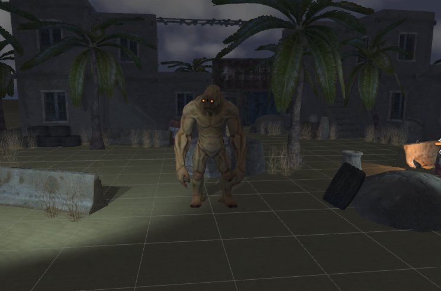
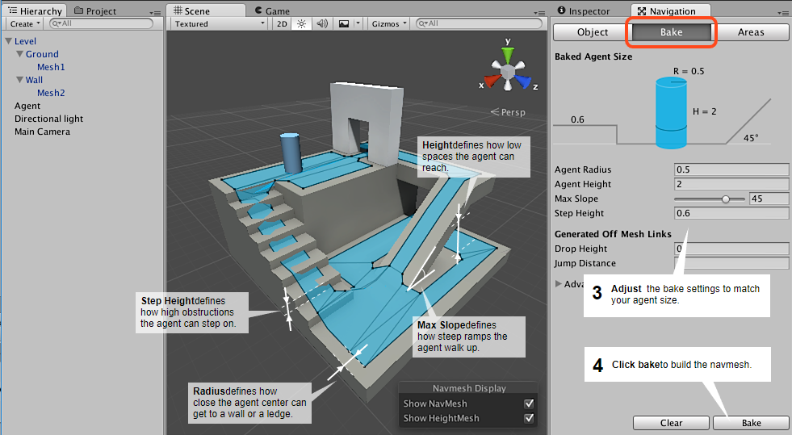
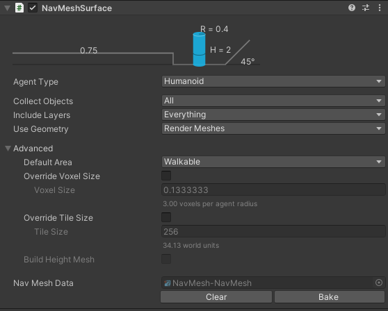
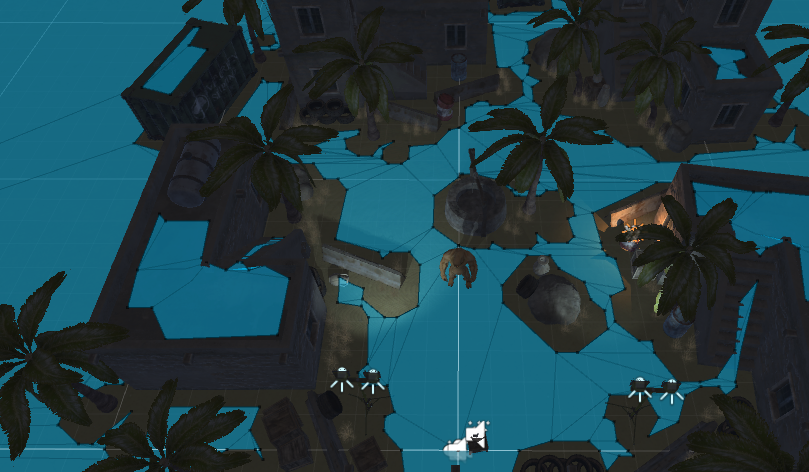
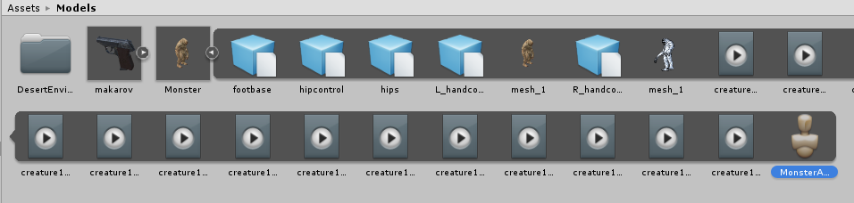
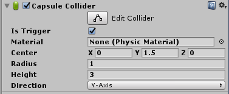
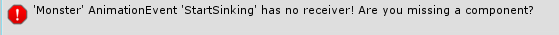

# AR Foundation Lab 3: The Monster
{:.no_toc}

## Table of contents
{: .no_toc .text-delta }

- TOC
{:toc}

---

In this lab, we’ll focus on the main antagonist of our game: the monster. Before we jump into it, let’s list out all the things that this monster has to do:

- Move towards the player while avoiding obstacles.

- Attack the player when it’s close enough.

- Die after getting shot, then disappear.

- Do all of the above with appropriate animations and sounds.

# The Monster Prefab

Open the provided Lab scene in the assets folder. Within the prefabs folder, we’ve provided a Monster prefab for you already. Double-click the environment prefab to open up the prefab and drag the monster prefab into the environment prefab hierarchy so that the monster is a child of the environment. Turn it around to face the player.

As you’ll notice, the monster gameobject has two children already: hips and mesh_1. mesh_1 contains the mesh renderer that gives it the look it has, while the actual mesh itself is contained in the tree-like structure within hips, which contains the positions of all the bones in our monster’s skeletons (also called the rig).

We won’t go into the 3D modeling details. If you wish to learn more, UCBUGG is a well-established and fantastically run decal on the subject. We’ll focus instead on how to use this 3D model in our project.

# Creating the Navmesh

Moving our monster is a deceptively challenging task when there are obstacles in the way. There are a lot of ways to do it (if you’ve taken CS61B, you’ll remember Dijkstra's algorithm or A* search, which can be adapted to work in this situation), but actually implementing one would be outside the scope of this course. Luckily, Unity already has a navigation infrastructure in place that we can take advantage of.

What we’re going to do is build what’s called a navigation mesh, or navmesh for short. A navmesh is a map of the environment that enables supported agents, called navmesh agents, to traverse the environment. By building this map ahead of time, agents won’t have to repeatedly compute where they can and cannot go while the game is running.

You can read more about Unity’s navigation system [here](https://docs.unity3d.com/Manual/Navigation.html).

Unlike the VR lab we must bake the navmesh into the prefab so the navmesh will work when we place the environment down on an AR plane. Unity already has navmesh functionality but to help us we will be using the navmesh components library. https://github.com/Unity-Technologies/NavMeshComponents

This library provides us tools to work with navmeshes and even build them at runtime. Follow the instructions to clone the repo and copy the contents of Assets/NavMeshComponents into our lab project. (You can just download the file and import Assets/NavMeshComponents).

Okay with the NavMeshComponents installed, open the environment prefab. (Select the environment prefab and double click on it)

To start off, we must mark the parts of the scene that our monster needs to traverse. Select the Environment object and in the top right of the inspector view, click the drop-down arrow next to the “Static” label and check “Navigation Static”. Say yes when it asks if you want to apply this to Environment’s children. This is us promising Unity that, for the purposes of navigation, we won’t be moving any of the objects within the Environment. 

Next, create a new gameobject in the environment prefab hierarchy named NavMesh. Add the component NavMeshSurface to this gameobject. In the inspector click on Agent Type > Open Agent Settings. Navmeshes are built given certain assumptions about the agent traversing it. As you can see, Unity assumes our agent is a cylinder of certain radius and height. This will let you edit the characteristics of our agent. We’ll only change one of these settings: set Agent Radius to 0.4 to better fit our monster.

In our game we will only have one type of agent running around the map. However, the navmesh supports many different agent types. You can create different agents with different heights, step heights, and abilities. For instance, you can have different agents navigate different parts of the map, lava monsters, flying characters, etc. Feel free to explore this when you make your own game!

Return to the inspector and click bake at the bottom of the NavMeshSurface component. This should build the navmesh into our prefab and you should now see a navmesh object in the prefabs folder.

# Moving the Monster

Now that we have a navmesh, let’s turn our monster into a nav mesh agent and move it. Add a “nav mesh agent” component to our monster gameobject. This component interacts with the navmesh and allows whatever object it’s attached to to move intelligently.

Change Speed to 0.75 (you don’t want the Monsters sprinting at you) and change Stopping Distance to 1.3. This indicates that once the monster gets within Stopping Distance of its target, it’ll stop moving - this will be useful once we incorporate attacks. Next, notice that we’re using the Humanoid agent type. Go to the Agents tab in the navigation window and change Radius to 0.4 to match the radius we used for the navmesh.

Next, create a new script called “Monster” that we’ll use to control all functionality of the gameobject. Start off by creating and initializing variables for the player, nav mesh agent, and audio source component. Note that in order to utilize the NavMeshAgent class, we’ll have to import UnityEngine.AI.

using System.Collections;
using System.Collections.Generic;
using UnityEngine;
using UnityEngine.AI;

    public class Monster : MonoBehaviour {

        private NavMeshAgent navMeshAgent;

        // Use this for initialization
        void Start () {
            navMeshAgent = GetComponent<NavMeshAgent>();
        }
        
        // Update is called once per frame
        void Update () {
            
        }
    }

Then to get the monster moving, all we have to do is add this line to Update(), which will repeatedly set the destination of the monster to the player’s location. We use the AR Camera as the position of the player so make sure to tag the AR Camera as the MainCamera.

    void Update(){
        Vector3 targetPos = GameObject.FindWithTag("MainCamera").transform.position;
        navMeshAgent.SetDestination(targetPos);
    }

It looks a little odd to see our monster power-slide to its destination, so we’re going to add in animation support. Add an Animator component to the Monster. We’ve provided a Controller for you in Assets > Animations > Monster and an Avatar (the mapping between Unity’s normal bone structure and a special one) in Models > Monster > MonsterAvatar. Drag those into their fields.

Take a look at the monster controller in the Animator window. It’s a little more complicated than the gun controller, but not by much. Notice that we start off in the “Walking” state. If you press play now, the monster should walk towards you with a lumbering walk animation.

Before continuing, we’re going to add in sound support. Add an audio source component to the Monster and disable Play On Awake. Then in Monster.cs, declare/initialize it properly along with three audio clips, which we’ll use throughout the lab. Play the spawnClip in Start() to announce that this Monster has spawned.

private NavMeshAgent navMeshAgent;
private AudioSource audioSource;

public AudioClip spawnClip;
public AudioClip hitClip;
public AudioClip dieClip;

    void Start () {
        navMeshAgent = GetComponent<NavMeshAgent>();
        audioSource = GetComponent<AudioSource>();
        audioSource.PlayOneShot(spawnClip);
    }

In Unity, you can find and fill in the appropriate clips in Assets > Sounds. The spawnClip is grrr1, hitClip is hit1, and dieClip is (very surprisingly) called die.

# Attacking the Player

The next thing we want to do is have the monster begin attacking the player once it gets in range. Looking at the monster controller again, we see that the state transitions from Walking to Attack when the “Attack” bool parameter is set to true. Let’s do just that in our Monster.cs script.

We’ll need to add a check to make sure we’re in range to attack. First, add a public attackRange variable and set it to 1.3 in the editor. Then add and initialize the animator variable.

    public class Monster : MonoBehaviour {

        public float attackRange;

        private NavMeshAgent navMeshAgent;
        private AudioSource audioSource;
        private Animator animator;

        ...

        // Use this for initialization
        void Start () {
            navMeshAgent = GetComponent<NavMeshAgent>();
            audioSource = GetComponent<AudioSource>();
            audioSource.PlayOneShot(spawnClip);
            animator = GetComponent<Animator>();
        }

        ...
    }

Then in update, compute the distance between the monster and the player. Since we only care about the 2D distance between the two, we’ll zero out the y component before computing the magnitude.

    void Update () {
        Vector3 targetPos = GameObject.FindWithTag("MainCamera").transform.position;
        navMeshAgent.SetDestination(targetPos);

        Vector3 distanceVector = transform.position - targetPos;
        distanceVector.y = 0;
        float distance = distanceVector.magnitude;
    }

Use this distance to check whether or not we should transition into attacking.

    void Update () {
        ...
        
        if (distance <= attackRange) {
            animator.SetBool("Attack", true);
        }
    }

If you'd like save your work and place a monster down in the environment prefab. Build the project and the monster should walk towards you, then stop some distance away and start hitting you with its fists.

Unity allows you to hook up [animation events](https://docs.unity3d.com/Manual/AnimationEventsOnImportedClips.html) to certain points in time within an animation. These events take in a function name. When the animation plays in-game and reaches that point in time, Unity will look for that function and call it. In this case, there’s an animation event attached to the moment the monster’s fists hit the ground, with function name “Attack”. Since we don’t have a function called “Attack” yet, it raises this error. Stub in the Attack() function to fix this; we’ll just play the hitClip sound for now.

    public void Attack() {
        audioSource.PlayOneShot(hitClip);
    }

# Shooting the Monster

Now that the monster can attack us, it’s only far that we be able to fight back. On a high level, this is the procedure for shooting the monster:

1. Player shoots gun. Invisible ray comes out of the gun and travels forward.

2. Ray hits an invisible collider on the monster, which calls a function.

3. Monster triggers its hurt animation, takes damage.

4. If monster loses all its health, kill it.

Start by adding a capsule collider to the monster. Set the radius to 1, the height to 3, the center to 1.5, and mark it as a trigger so it doesn’t collide with the environment. It should just about encapsulate the monster. You can make the collider larger or smaller depending on how difficult you want hitting the monster to be.

Next, switch to editing the Gun.cs script. We’re going to add a raycast check to Fire() to check if we’ve hit a monster. I won’t pretend to be able to explain raycasting better than Unity itself, so before looking at the code below, watch the first minute and a half of [**this video**](https://unity3d.com/learn/tutorials/topics/physics/raycasting). **Raycasts can be confusing intuitively, so don’t be afraid to ask for clarification!**

    public void Fire() {
        audioSource.PlayOneShot(audioSource.clip);
        animator.SetTrigger("Fire");
        particleSystem.Play();

        RaycastHit hit;
        Vector3 origin = particleSystem.transform.position;
        Vector3 direction = particleSystem.transform.forward;
        if (Physics.Raycast(origin, direction, out hit, 100f)) {

        }
    }

We’re using the position/rotation of MuzzleFlashEffect (the gameobject particleSystem is attached to) for the origin of the raycast since it sits at the front of the gun where the bullet would come out of. The direction is set to "forward" direction because it’s the blue arrow in the scene view (which corresponds to the z axis) that points out of the gun barrel. We’ve defined a hit object to hold any data that comes through, and the ray itself lasts for 100 meters.

The end result is that this if case returns true only if the fired raycast hit something, with whatever collider it hit stored in the “hit” variable. We’ll now check if that collider belonged to a monster. If it does, we’ll extract the Monster script from it and call an appropriate function.

(If it seems like the gun is not affecting the monster. Try setting the direction to a different direction (such as particleSystem.transform.right).

    public void Fire() {
        ...

        if (Physics.Raycast(origin, direction, out hit, 100f)) {
            GameObject hitObject = hit.collider.gameObject;
            if (hitObject.CompareTag("Monster")) {
                print("Hit a monster!");
            }
        }
    }

In Unity, assign the “Monster” tag to the monster gameobject, creating it if necessary. 

# Hurting the Monster

Before we start replacing the print message with proper damage-taking interaction, we need to go into details on the monster’s various gameplay states. Our monster can be in one of three states at any given point in time:

1. ALIVE: In this state, the monster will move towards and attack you.

2. DYING: In this state, the monster has taken enough damage and is in the midst of doing its death animation. It will no longer move towards you and cannot take further damage.

3. SINKING: In this state, the monster has finished its death animation and is now sinking through the ground before finally getting removed from the game.

To implement this in script, we’re going to use C#’s [enum](https://docs.microsoft.com/en-us/dotnet/csharp/language-reference/keywords/enum) system to list the possible states and a variable to track which state we’re in. Switch to Monster.cs.

    public class Monster : MonoBehaviour {

        public enum State {
            ALIVE, DYING, SINKING
        }
        
        public State monsterState = State.ALIVE;

        ...

    }

Our monster should only be moving around if it’s in the ALIVE state. Encapsulate the code you’ve written in Update() so far in an if block checking for this.

    void Update () {
        if (monsterState == State.ALIVE) {
            ...
        }
    }

Next, we’re going to implement the monster’s health. Add a public int maxHealth (set that to 100 in Unity) and private int currHealth to the class. Initialize currHealth properly in Start(). Finally, stub in a public Hurt() function that we’ll be using soon.

public int maxHealth;
private int currHealth;

    void Start () {
        ...

        currHealth = maxHealth;
    }

    ...

    public void Hurt(int damage) {

    }

Now switch back to editing Gun.cs. Add a public int damage, which will represent how much damage each bullet deals to a monster.

    public int damage;

Set it to 20 in Unity. Then in the raycast section, remove the print statement. In its place, extract out the monster script from the monster gameobject, and call the Hurt() function with the newly defined damage var as the parameter.

    RaycastHit hit;
    Vector3 origin = particleSystem.transform.position;
    Vector3 direction = particleSystem.transform.forward;
    if (Physics.Raycast(origin, direction, out hit, 100f)) {
        GameObject hitObject = hit.collider.gameObject;
        if (hitObject.CompareTag("Monster")) {
            Monster monsterScript = hitObject.GetComponent<Monster>();
            monsterScript.Hurt(damage);
        }
    }

Switch again to editing Monster.cs so we can fill out the Hurt() function. It’s fairly straightforward: we first check if the monster is still alive, and if so call the proper animation trigger (which you can view in the Monster’s animation controller. We also subtract the damage taken from its current health, and if it dips below 0 we’ll call Die(), which we’ll stub in with a print statement for now.

    public void Hurt(int damage) {
        if (monsterState == State.ALIVE) {
            animator.SetTrigger("Hurt");
            currHealth -= damage;
            if (currHealth <= 0)
                Die();
        }
    }

    void Die() {
        print("Monster died.");
    }

# Killing the Monster

Filling in the Die() function is fairly straightforward:

- Set the state appropriately.

- Play the dying sound effect (dieClip).

- Stop navigating towards the player.

- Trigger the appropriate animation.

    void Die() {
        monsterState = State.DYING;
        audioSource.PlayOneShot(dieClip);
        navMeshAgent.isStopped = true;
        animator.SetTrigger("Dead");
    }

If you try the game now, you should be able to see all this happen after shooting the monster five times! You should also notice an error message in the console:

This is an animation event hooked up to the end of the death animation. If we were to just let the monster sit there forever, the corpses would end up glitching into one another and lagging the game. So we’re now going to use this animation event to make dead monsters sink through the floor and then disappear after dieing. Stub in the public StartSinking() function.

    public void StartSinking() {

    }

There are a couple things we need to do in this function:

- Set the state appropriately.

- Disable the navigation component. The nav mesh agent component overrides movement control from other sources, so in order to make our monster sink through script we must disable this component first.

- Set the monster to be destroyed after a set amount of time. We’ll use 5 seconds, which should be long enough for the monster to fully move through the floor.

    public void StartSinking() {
        monsterState = State.SINKING;
        navMeshAgent.enabled = false;
        Destroy(gameObject, 5);
    }

Next is to make the monster actually sink, which we’ll do in the Update() function. Add a public float sinkSpeed, which will represent how quickly the monster sinks through the ground.

    public float sinkSpeed;

Then in Update(), add an else if block for when our monster is in the sinking state. In it, we’ll calculate how far down the monster needs to move this frame and translate it downwards that much. Time.deltaTime returns the time between this frame and the previous.

    else if (monsterState == State.SINKING) {
        float sinkDistance = sinkSpeed * Time.deltaTime;
        transform.Translate(new Vector3(0, -sinkDistance, 0));
    }

Set sinkSpeed to 0.15 in Unity, and give it a try! Killing the monster should now make it sink through the floor before disappearing from the scene.

*We'll be building the monster spawning system in the next lab so for now you can just put a monster (or multiple) in the environment prefab.*