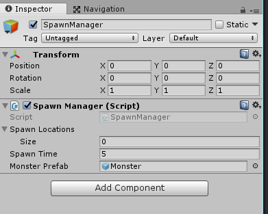
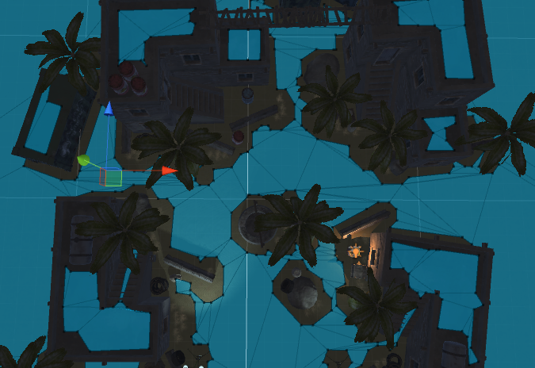
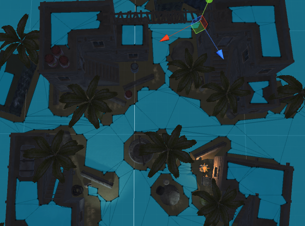
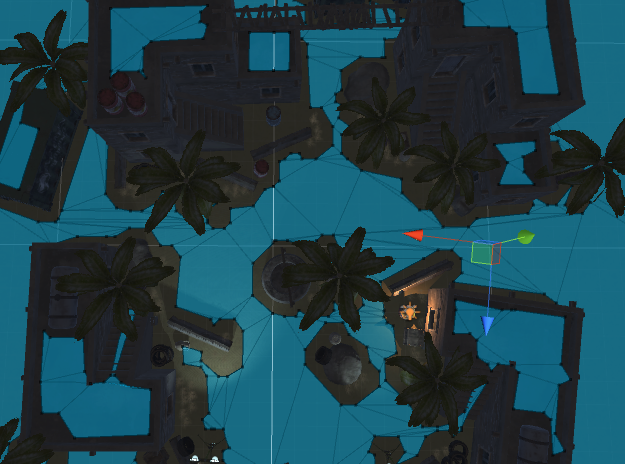
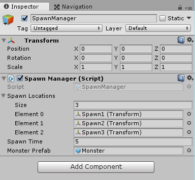

# Vive Lab 4: Putting It All Together
{:.no_toc}

## Table of contents
{: .no_toc .text-delta }

- TOC
{:toc}

---

In the final lab of this series, we’ll be taking all of the components you learned about and created thus far and put them together into a single cohesive experience. We’ll also take care of some odds and ends that we didn’t get to in the previous labs.

Imagine the flow of the game, from initialization to finish. Here’s everything that needs to happen:

- Player puts on the headset and picks up the gun. *Done*.

- Monsters start spawning periodically from preset locations and walk towards the player. *We’ve done the latter, but not the former*.

- Players can shoot and kill monsters. *Done*.

- Upon reaching the player, monsters will attack, causing the player to take damage. *We’ve done the former, but not the latter*.

- Upon losing all health, the game restarts. *Not done*.

You can download the skeleton package [**here**](https://drive.google.com/file/d/12tQdeEr4EkIlDzzqkCJ_G3V2dKPRrwzv/view?usp=sharing).

*Important: Certain parts of this lab have been left without explicit instruction. This is on purpose, and those parts must be completed in order to finish the lab.*

# Spawning Monsters

To start things off, let’s update our monster prefab so that when we spawn it via script it has all the functionality the monster in our scene has. Select the monster gameobject and click Apply in its prefab options.

After you’ve done this, you can remove the monster within the scene - we don’t want to get assassinated the instant we start the game.

Next, create a script called SpawnManager. This script will manage the spawning process for the monsters. Declare in it the following public variables and stub in the Spawn() function.

    public class SpawnManager : MonoBehaviour {

        public Transform[] spawnLocations;

        public float spawnTime;

        public GameObject monsterPrefab;

        ...

        public void Spawn() {

        }

    }

The variables are pretty self explanatory - spawnLocations will contain a list of locations (transforms) where monsters could spawn from, spawnTime is the time interval between spawns, and monsterPrefab is the gameobject that gets spawned.

Let’s fill out Spawn(). Every time this function gets called, we’ll want to choose a random transform to spawn it at. We’ll instantiate the monster, then position and rotate it accordingly.

    public void Spawn() {

        Transform spawn = spawnLocations[Random.Range(0, spawnLocations.Length)];

        GameObject monster = Instantiate(monsterPrefab, spawn.position, spawn.rotation);

    }

Random.Range(x, y) returns a random integer between x inclusive and y exclusive. As a side note, if you feed it two floats instead, it’ll return you a random float instead.

Now we have to repeatedly call this function every couple seconds. While we could write a timer system in Update() using GetTime(), Unity actually has a function for this particular use case. Put the following line in the Start() function.

    void Start () {

        InvokeRepeating("Spawn", spawnTime, spawnTime);

    }

InvokeRepeating is a Unity function that will call the function in the first argument after a certain amount of time, dictated by the second argument. It will then continue to call this function at set intervals (the third argument). In our case, Unity will call Spawn() after spawnTime seconds and continue to do so endlessly.

Let’s add the SpawnManager script to our game. Create a new empty gameobject called “SpawnManager”, and attach this script to it. Set Spawn Time to 5 and set the monster prefab correctly.

To fill in Spawn Locations, we’re going to create empty gameobjects (which contain only transforms) and position them around the map where we want monsters to spawn.

But where do we want to spawn them? The locations should be out of the player’s sight, so that they can’t see them pop into existence. They also have to be on the nav mesh, otherwise the spawned monster wouldn’t be able to navigate properly. To make sure we’re meeting these requirements, open up the navigation window, which should cause the blue navmesh to appear.

Create a couple empty gameobjects and call them Spawn (you can number them if you wish). Position them around the map such that they’re on the navmesh and out of the player’s line of sight.

Once you’re satisfied with your spawns, select SpawnManager and drag the spawns onto the Spawn Locations array to add to the list.

Give it a shot! Starting the game now should cause a monster to spawn once every 5 seconds, and… walk in place. Time for an exercise in debugging.

## Debugging Exercise

Before continuing on with the lab, figure out why the monsters are walking in place and fix it so that the newly spawned monsters successfully navigate the environment and walk towards you after spawning. You might want to refer back to lab 4 for implementation details. If you're feeling lost, we've listed some tips below that might help.

1. Recall what you did during the last lab to make the monsters move. Since the monsters are playing their walk animation, it means they're trying to move, but don't know where to go. For what reason might this happen?

2. Start the game, then switch back to scene view and select one of the monsters to view it in the inspector. Are any of the properties incorrect?

3. Once you've isolated the cause, try to figure out why it's happening (since your monster was working fine in the previous lab). What's the difference between spawning a new monster from a prefab and having it in your scene in the first place?

4. Finally, once you understand the problem, come up with a solution to fix it. Remember that all public properties can be viewed and modified from any script.

Hint: Prefabs cannot access any gameobjects from a specific scene. This is because prefabs have to work across all scenes, and even across different projects. For that reason, they cannot use anything that's tied to a single scene.

# The Player

We’re now going to create a script to deal with player specific logic. Create and begin editing a new script called “Player”. Similar to the monster, we’ll want to track the player’s state (either alive or dead) with enums and also store the player’s health.

    public enum State {

        ALIVE, DEAD

    }

    public State playerState = State.ALIVE;

    public int maxHealth;

    private int health;

    void Start () {

        health = maxHealth;

    }

There’s only one interaction we haven’t implemented yet for the player: getting hurt by monsters. Stub in the public Hurt() function.

    public void Hurt(int damage) {

    }

This function is nearly identical to the Hurt() function in Monster.cs. Fill it out and stub in a Die() function as well.

    public void Hurt(int damage) {

        if (playerState == State.ALIVE) {

            health -= damage;

            if (health <= 0) {

                Die();

            }

        }

    }

    void Die() {

    }

What happens when the player dies? There’s a lot of things we could do, but for simplicity we’ll just restart the level. Unity gives you the ability to load up a new scene in its library UnityEngine.SceneManagement, so import it at the top of the file.

    using UnityEngine.SceneManagement;

Then in Die(), tell Unity to load up a new scene. We called our scene “Lab”, but make sure to feed in whatever you called your scene file.

    void Die() {

        SceneManager.LoadScene("Lab");

    }

In Unity, add the player script to your ScriptManager gameobject and set Max Health to 100.

All that’s left is to call Hurt() whenever the player gets attacked by a monster. Switch to editing Monster.cs, and in it declare a damage variable and a reference to the Player script you just wrote.

    public int damage;

Finally, modify the Attack() function so that it calls Hurt() appropriately to damage the player. As with the debugging exercise earlier, we will leave the implementation open-ended.  Again, here are some tips:

- We now have two things called "player" in our project. The first one, "player" is a property you defined in Monster.cs during the previous lab and represents an item that gives us the location of the player (CameraRig). The second is Player.cs is the script that you just created. Don't get mixed up between the two.

- For monsters to be able to hurt the player, there needs to be some link between the monster script on on a spawned monster and the player script in the scene that you just added.

- Remember that all components are scripts and vice-versa, from the ones default to Unity like Rigidbody or AudioSource, to the ones you created and added to a gameobject yourself.

Try it out! When monsters attack you up to 5 times now, the scene should restart (indicating that you’ve lost).

# Final Remarks

Congratulations! You now have a fully implemented game that you’ve created for the HTC Vive. There are a ton of things that could be added and improved, of course, such as moving the trigger of the gun or and adding screen effects to the camera (for the curious, that’s what the Flash script is for). We hope that this lab series gave you enough knowledge and familiarity with Unity/HTC Vive to improve or kickstart your own projects.

*To check off, show a facilitator that the entire game works - that you can operate the gun, that monsters spawn and move towards you, that you can defeat monsters, and that they can defeat you.*