# Oculus Lab 1: Building the Environment
{:.no_toc}

## Table of contents
{: .no_toc .text-delta }

- TOC
{:toc}

---

Welcome to Monster Shooter! Over the course of 4 lab sections, you’ll be building a game that looks like this:

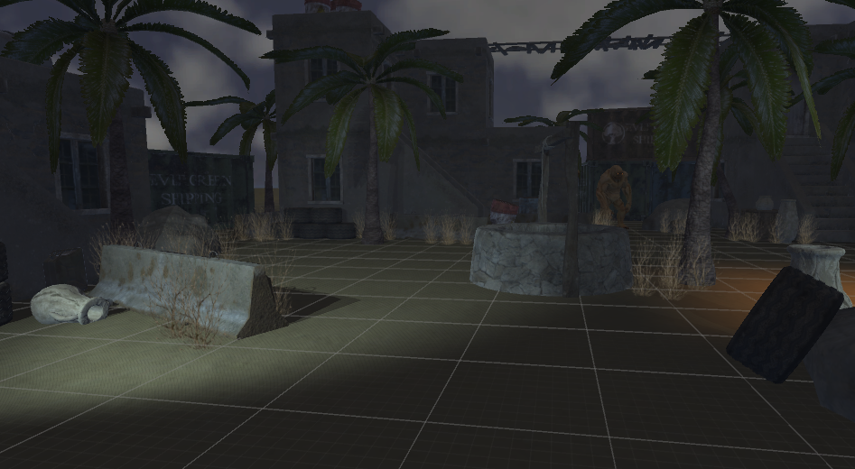

These labs will not be a comprehensive overview of everything that Unity and VR has to offer. However, they will touch upon a lot of different topics so that you get a taste of what is possible. The labs will also serve as practice for creating a project from start to finish, something that will be valuable for the final project.

# The Game

Monster Shooter is a survival shooter game. Set in a small desert town, you use your trusty pistol to fend off hordes of monsters until you reach your eventual demise.

We can divide the game into several distinct chunks. Each lab will focus on a single one.

1. The environment. The world that you see around you when you put on the headset. All the props, textures, skyboxes, models, etc. Most of it will be static and stationary for the game, with the sole exception of the gun.

2. The gun. Namely, being able to pick it up and shoot it. This sounds simple, but requires scripting, animations, particle effects, sound effects, and input management from the controller in order to create that split second experience when you pull the trigger.

3. The monsters. They must be able to navigate the environment and make their way towards the player, where they’ll attack when in range.

4. The manager. This manages the spawning of monsters over the course of the game, and also what happens when you take too much damage and die.

For this lab, we will focus on the initial setup of the project and the creation of the environment.

# Project Setup

First, download the project skeleton [**here**](https://drive.google.com/file/d/19s386jba_GvCYvk4_YbZbQpaFumhpYjd/view?usp=sharing) (or check if it's already been downloaded onto your computer). This is a unitypackage that contains all the assets and resources needed to build the project. Next, create a new project and import the downloaded unitypackage. You can do this through Assets > Import Package > Custom Package.

Importing might take a while, as Unity will have to load and configure a lot of textures and libraries. In particular, if you see Unity getting stuck importing something called “AvatarSurfaceShader”, don’t be alarmed - that particular asset will usually take a long time.

Once it’s finished, you’ll see in your Project view a bunch of folders, which we’ll briefly give a rundown for below.

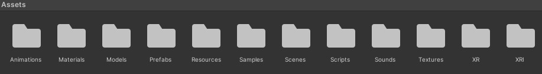

- Animations: Contains animation data for the gun and monsters.

- Materials: Contains the materials that help define what each object looks like in game.

- Models: Contains the 3D models.

- Prefabs: Premade objects that you can drop or spawn into a scene. Some of these are akin to just models, but others have other components or functionality attached.

- Resources: Another auto-generated folder. This one only contains some data for the Oculus.

- Scenes: Contains the scene for our labs.

- Scripts: Contains the scripts that help run and drive the game.

- Sounds: Contains the sound files.

- Textures: Contains the images that feed into the materials in the Materials folder.

- XR / XRI: Folders with XR-related settings and defaults

A final thing before we delve into creating the scene: go ahead and reset your editor layout via Window > Layouts > Default. Any screenshots shown (like the one above) will be using this layout and will make following along easier. This has no effect on the actual project, so if you prefer using a different layout, you are free to do so.

# Creating the Scene

Let’s start by creating a new scene. Right-click some empty space within the Project view and select Create > Scene, and call it “Lab”. Double-click your newly created scene to open it.

The first thing you’ll want to do is delete the Main Camera and Directional Light objects that come part of the scene - we’ll add our own camera and lights in a bit.

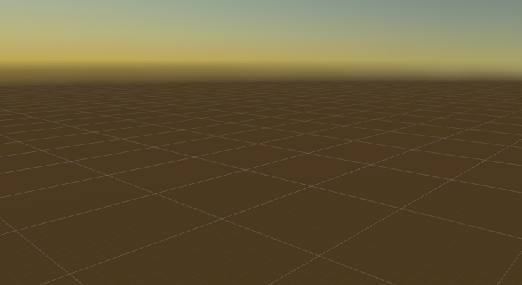

Now go into the Prefabs folder and look for a prefab called “Environment”. To save you a couple hours of work, we’ve created the physical map for you. Drag the prefab into the Hierarchy view on the left side to spawn an instance of it into your scene.

Scene with the environment prefab dropped in.

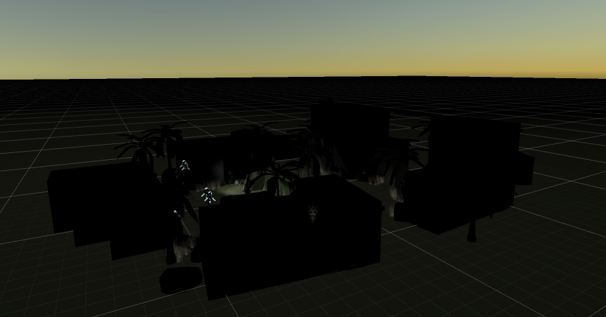

Make sure the environment’s transform component in the Inspector view is zeroed out in position and rotation, and has a xyz-scale of 1.

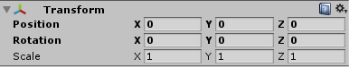

If your values don’t match, click the gear in the top right and hit “Reset”.

You’ll notice that the lighting is off - the buildings are way too dark and shadows aren’t being cast properly. We’ll fix that, but first we’ll change the skybox (the textures that surround the scene) to something that looks more like the night sky.

Go to Window > Rendering > Lighting > Environment, which will open a new window that contains all the lighting data for this scene. Look for the “Skybox Material” line under 'Environment', and click the little circle on its right side. This will open up a box that lets you select which skybox to use. Search for “nightsky2” and select it.

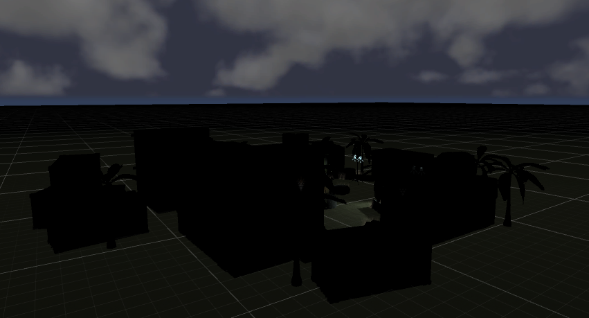

With our skybox in we can now properly fix our lighting. To have Unity auto-generate lighting, go to the 'Scene' tab on the Lighting window. Select the asset for 'Lighting Settings Asset' to be LabLighting'. Then, you check “Auto Generate" and click “Generate Lighting” to start computing the proper lighting for the scene.

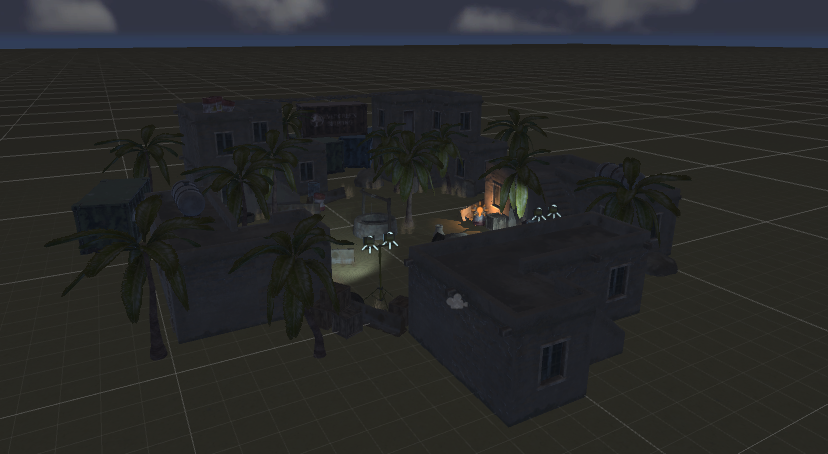

# Putting in VR Support

If you try pressing play now, you’ll just get a black screen telling you that no cameras are rendering. This is because we removed the Main Camera GameObject that comes with every new scene. Let’s fix that now.

First, our project does not have any packages that support XR functionality, so let us install them.

Go to **Window > Package Manager** and switch the top tab from "Packages: In Project" to "Packages: Unity Registry" to see all of the available packages. Install "XR Plugin Management", "Oculus XR Plugin", and "XR Interaction Toolkit". Let the package manager restart your project to make changes if asked. Now we have the necessary packages to get started!

(If you don't see XR Interaction Toolkit then click the "+" on the top left and "Add Package by Name..." and insert "com.unity.xr.interaction.toolkit".)

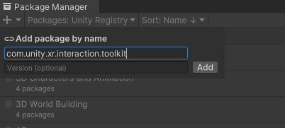

Next, we need to define default inputs so when we make the GameObject for the player, it will have inputs mapped to the Rift S control set. To first set the defaults, go to **XR > XR Interaction Toolkit > 2.1.1 > Starter Assets**, and select "XRI Default Left Controller" and select "Add to ActionBasedController default". There is another default for the right controller, do the same for this one. 

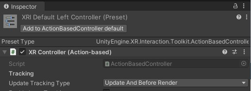

As of now, there are two defaults for a single preset! To remedy this, go to **Edit > Project Settings > Preset Manager**, and for the right controller, add "right" to the filter, and do "left" for the left one. This will let unity differentiate between which defaults to apply:

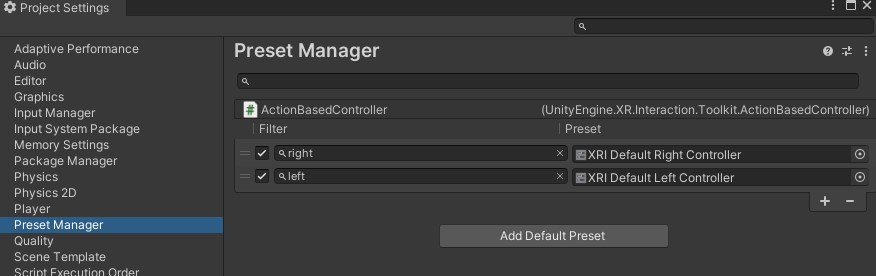

Next, right-click anywhere on the GameObject Hierarchy, and select **XR > XR Origin (VR)**. This will place a GameObject that will be the game camera and interpret controls. Set its positional Transform values to (0,0,0) or by clicking "Reset" on the dropdown menu on the top right of the component.

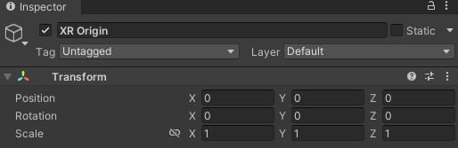

Think of this GameObject as the player. If you go from **XR Origin > Camera Offset > ...**, you can see that the left and right controllers have actions that correspond to "LeftHand" or "RightHand" respective to its controller.

Unity needs a way to read the values of a given action, so if we go to **XR Interaction Manager** in the hierarchy, click on **Add Component** on the Inspector panel and search for a "Input Action Manager". Let us press on the "+" and select the "XRI Default Input Actions". 

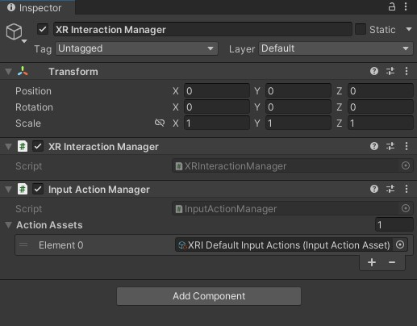

Ok! That solves inputs for controllers!

There’s one final thing we need to do before we can put on the headset. Go to **Edit > Project Settings > XR Plug-in Management** and check “**Oculus**” if it’s not already enabled. Then put on the headset and press play!

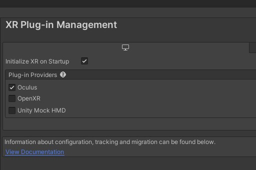

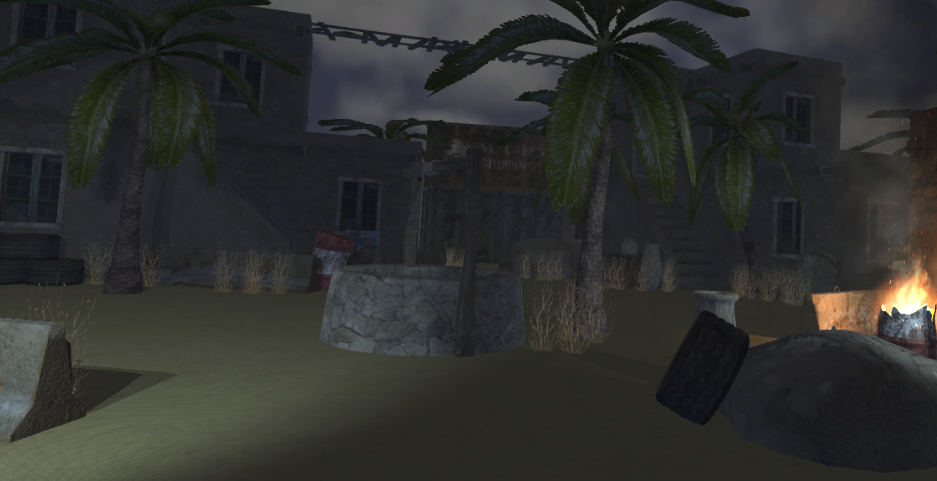

*Note: If it looks like this image in the headset with red lasers, you’re all good! If you seem to be stuck in the ground, select your XR Origin within your hierarchy and, in the Inspector view, change Tracking Origin Mode from Not Specified to Floor Level. Now try it again.*

As you move your controllers around, you can see that there are red lasers coming from them. Let us disable these by disabling the "XR Ray Interactor" on both controllers. (As a reminder, you can find these controllers under **XR Origin > Camera Offset > Left/RightHandController**).

# Adding Hands and the Stand

We now want to add hands and the gun to our game so we can build interactivity between the two. Before adding the gun, however, we’re going to add a stand to put the gun on so that it’s within arm’s reach when you start the game.

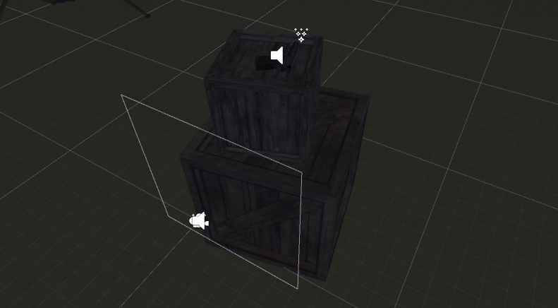

Let’s start with your hands and input. First, go to the hierarchy and go to **XR Origin > Camera Offset > LeftHand Controller**. On the XR Controller component, we can see that there is a **Model** area with a "Model Prefab" field. This will be where we can put our hand model. To find the hand models, go to **Prefabs > XR Prefabs** and assign LeftHand to the "Model Prefab" field. Do the same with the right-hand controller.

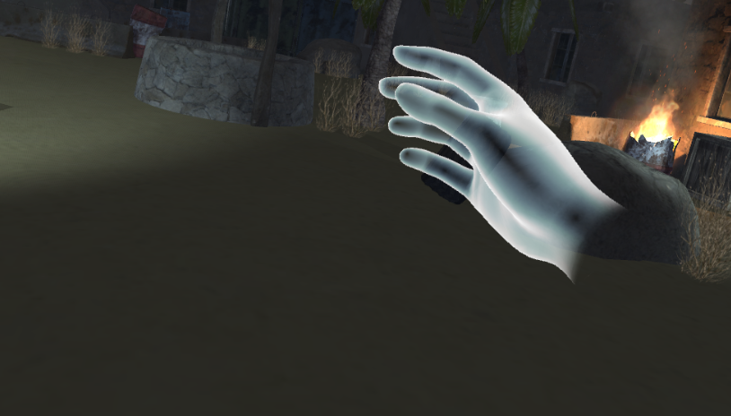

Next, let’s create the two crates that make up the stand. If you look to the left of your starting location, you’ll notice there’s already a crate there we can use. Duplicate it off twice, and move the new objects out of the Environment object so that they’re parentless - this will make it easier to select and move them. Rename one to “Lower Crate” and the other to “Upper Crate”. Your hierarchy should now look like this.

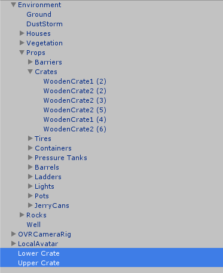

Use the movement (w), rotation (e), and scale (r) tools to position these crates into the shape shown in the first picture of the section. The lower crate should be just to the right of OVRCameraRig, and the upper crate should be smaller and sit on top of it. Don’t worry about being exact - just keep testing it with the headset on until the top of the upper crate is comfortably within arm’s reach. A tip: With the scale tool, dragging the white cube scales all axes.

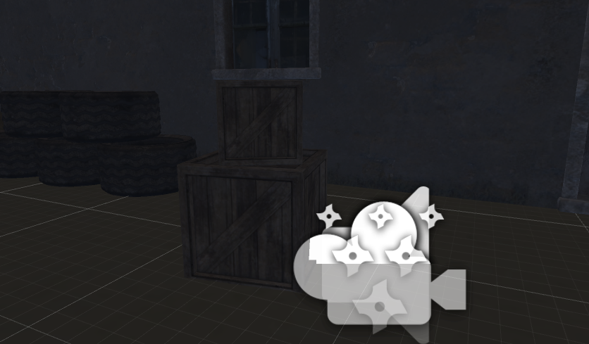

# Adding the Gun

Now we can create the gun. Start by right-clicking an empty spot within the hierarchy and clicking “Create Empty”. This will create an object with nothing but a transform component, which we’ll add to and flesh out over the course of these labs. Name it “Gun”, and reset its transform - we’ll move it later.

Go into the Models folder and find the object called “makarov”. This is the 3D model for our gun. Go ahead and drag it onto our newly created empty object, which will parent it under Gun.

Parenting is a concept in Unity that allows us to construct complex objects out of simpler ones and have them all move together as one. An object (call it the child) parented under another object (call it the parent) will have all its transform values defined as relative to that of its parent. This means when the parent moves, scales, or rotates, its child will change along with it.

Let’s rename this newly childed object to “Model”. It’ll start out being far, far too large, so scale each of its axes to 0.025. Then select its parent Gun and move it around, which should now move the 3D model around as well. Position/rotate gameobject Gun so it sits on top of the upper crate.

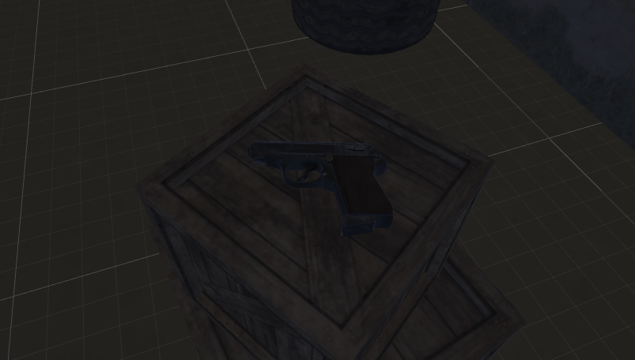

Next, we’re going to add physics functionality to our gun, so that players can throw it if they ever want to give up in style. With Gun selected, go to the Inspector view and use the Add Component button to add a Box Collider to our object. You’ll see a green box appear around the gun.

This green box is a collider. Colliders represent the bounds of an object when doing physics calculations (like collisions), and in Unity are either boxes, sphere, or capsules. Of course, a box can’t perfectly capture the bounds of a complex model like our gun, but it’ll do for the circumstances.

The default size of the box collider is neither the right size or shape. Change its size values so that X = 0.03, Y = 0.15, and Z = 0.2. The result should look like this:

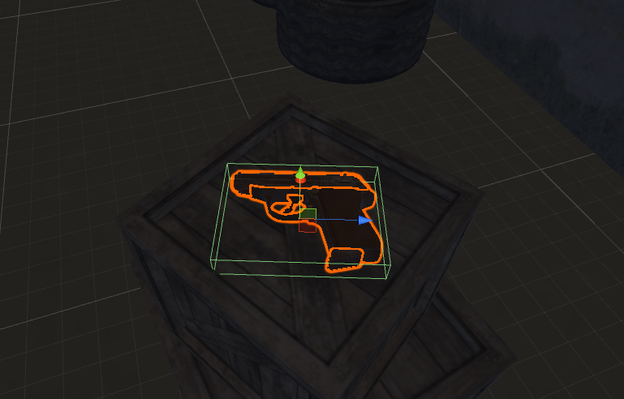

Now, add a Rigidbody component to Gun. Rigidbodies are what define something as a moving, physical object. It tells Unity how to treat this object in its physics calculations with variables like weight and drag. Note that an object cannot have a rigidbody component without also having a collider (since Unity needs physical bounds to perform physics calculations).

Let’s test whether or not our gun is a valid physics object. Raise it up a little in the inspector, then put on the headset and press play. You should see that the gun has fallen from its original location to rest on the upper box.

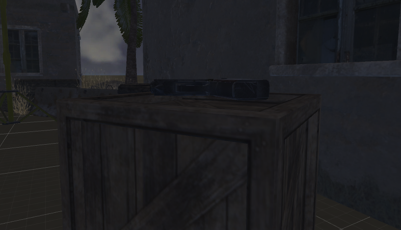

Actually, it hovers a little above the crate. Why?

# Adding to the Environment

Look through the project directory and find out where the 3D models used for this project are stored. You'll find a lot more than what we used in the scene! As a final exercise, drag in some of models and decorate the scene with them.

# Check Off

*This marks the end of lab 1! To check-off successfully, just let a facilitator see your current project and show them that you’ve completed all of the sections successfully. Additionally, answer the following questions:*

1. *Why does the gun hover over the crate? What's a potential solution to fix this and what would the drawbacks of that solution be?*
2. *What additions did you make to the scene?*