# Oculus Lab 2: Building the Gun
{:.no_toc}

## Table of contents
{: .no_toc .text-delta }

- TOC
{:toc}

---

In this lab, we’ll focus on interacting with the gun. For our gun, we want to implement the following functionality:

- Hovering over the gun and holding down the hand trigger / grip picks up the gun.

- While picked up, the gun no longer collides with objects and follows the hand.

- While picked up, pressing the index trigger fires the gun.

- When the hand trigger is released, the gun is dropped and becomes a physics object.

You can download the skeleton for this lab [**here**](https://drive.google.com/file/d/1hqi-KwT6aeFKFydsiW8lUqrgHsBvcNuy/view?usp=drive_link) - alternatively, you can directly start working off a completed Lab 1! **This is a long lab, so please don’t hesitate to ask the facilitators questions or just reach out if you get stuck. We’re here to help!**

After initializing the new project with the skeleton, you will need to install the XR packages again through **Window > Package Manager > (on the top) Packages: Unity Registry**:

- Oculus XR Plugin
- XR Plugin Management
- XR Interaction Toolkit (if not there: on the top left of the package manager, click the plus and add by name "*com.unity.xr.interaction.toolkit*")

# Grabbing the Gun with XR Interaction Toolkit

Because of the XR Interaction Toolkit package, we can easily grab objects only using the component system. First, go to the LeftHandController (**XR Origin > Camera Offset > LeftHand Controller**) and in the inspector, click **Add Component**, and add **XR Direct Interactor** with Hide Controller on Select box ticked and Sphere Collider with a radius of 0.2 and check the "Is Trigger" box. Repeat this with the RightHandController. 

Next, go to the Gun in the hierarchy and add the **XR Grab Interactable** component. Under **Movement Type**, select **Kinematic**. 

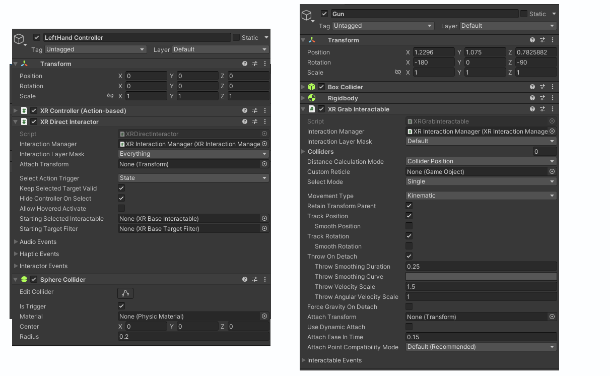

You can try to grab the gun with the grip buttons and feel free to move the boxes in the editor if you cannot reach it. You will immediately notice that there is a rotation problem upon grabbing the gun which prevents accurate shooting. Let's fix that by adding an offset to the attach transform field on the gun XR Grab Interactable. 

Create an empty GameObject with the name "Attach Transform" with rotation values x = -10, y = -165, z = 0, and drag this child GameObject to the Attach Transform field in the XR Grab Interactable Component.

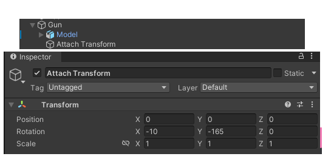

Ok! Now we can grab and aim the gun correctly. Now let us implement the firing of the gun. Because there are no available The outline of this is as follows:

- A controller script to read the trigger input from any controller and call a function from the Gun.

- A gun script with a function called Fire() that fires the gun.

First, we need to define what a "trigger" is. Because we use an Action-based control scheme (this is Unity's input handler), we need to define a "Trigger" action. To define, go to **Assets > XR > XR Interaction Toolkit > 2.1.1 > Starter Assets** and double-click on the XRI Default Input Actions (the lightning symbol). Now we have the "list" of actions that we can use as input.

Under Action Maps, select "XRI LeftHand Interaction". To the right Actions window, we can see that there are actions such as Select that read the button press from the corresponding inputs (this is what let us grab earlier). Click the plus on the Actions window and name it Trigger. Next, click on "<No Binding>" and on the Binding Properties window, select **XR Controller > XR Controller (Left Hand) > Optional Controls > triggerPressed** which will set this action to correspond with the controller's respective trigger button. Lastly, go back to the Trigger action and on the properties window, select Action Type as "Button". It should look like the image below for the left controller.

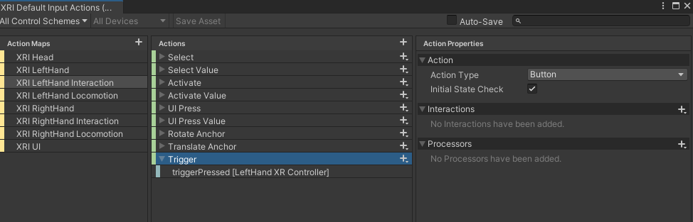

Do the same for the right controller (ensure the action is for the right controller) and we now have Input Action References that correspond to trigger buttons!

Now that we can read the trigger, let's make our first script. Go to the Scripts folder and right-click in the folder and **Create > C# Script** with the name **Hand.cs**. 

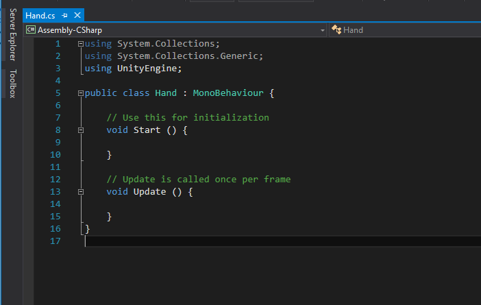

We’ll put in a public variable that represents the controller this hand is attached to (that’ll be set in the editor).

    using UnityEngine;
    using UnityEngine.InputSystem;
    using UnityEngine.XR.Interaction.Toolkit;

    public class Hand : MonoBehaviour {

        [SerializeField] public InputActionReference controllerActionTrigger;
        void Update()
        {
            if (controllerActionTrigger.action.ReadValue<float>() != 0)
            {
                Debug.Log("Trigger from " + this.gameObject.name.ToString());
            }
        }
    }

Here, the update function reads the value from the editor-specified InputActionReference and if pressed (!=0), then print the name of the GameObject for that frame. The public and private keywords have the same meanings they do in other programming languages, like Java. However, public variables can be seen and set in the Unity editor, while private ones cannot.

Now that we have this public value which we can edit in the Unity Editor, go to the Left Hand and Right Hand GameObject in the XR Origin and add the Hand script as a component. We can see a field for "Controller Action Trigger" where we can select the corresponding action reference (click the circle on the right of the field and search for "Trigger"; select the one for the corresponding controller).

Build and try pressing the triggers. Something like "Trigger from LeftHand/RightHand Controller" should be printed into the console whenever the trigger is pressed.

# Firing the Gun (Part 1)

Now that we’re successfully reading in input, let’s implement our first bit of functionality: picking up the gun. Before we do anything, we’ll add two variables to our Hand class: XRDirectInteractor interactor which references the controller interactable in the same GameObject. We can access the gun and other variables from this interactor.

    // This should be after the public declaration of InputActionReference
    private XRDirectInteractor interactor;
    private void Start()
    {
        interactor = GetComponent<XRDirectInteractor>();
    }

There are three requirements that must be met for us to try and pick up the gun:

1. Our hand must be touching/inside the gun.

2. We must hold down on the hand trigger for that hand’s controller.

3. We must not already be holding a gun.

Let’s start with the first requirement. How can we detect whether or not our hand touching the gun **via script**? The answer is with [**triggers**](https://unity3d.com/learn/tutorials/topics/physics/colliders-triggers) and checking the Interactor we implemented earlier. 

You might remember from the roll-a-ball tutorial that triggers are a type of collider. Objects with trigger colliders do not collide with other things normally. They freely pass through them and this can be detected via code. For our purposes, we already have a trigger collider when we were setting up the grab interactable where we can detect collisions in the script and check if the other collider is a gun.

Switch back to Hand.cs in Visual Studio. Add the following function to the class:

    void OnTriggerStay(Collider other) {

    }

This [**function**](https://docs.unity3d.com/ScriptReference/Collider.OnTriggerStay.html) automatically gets called every frame our hand touches a valid object. To delve into what counts as a “valid” object, see the chart below:

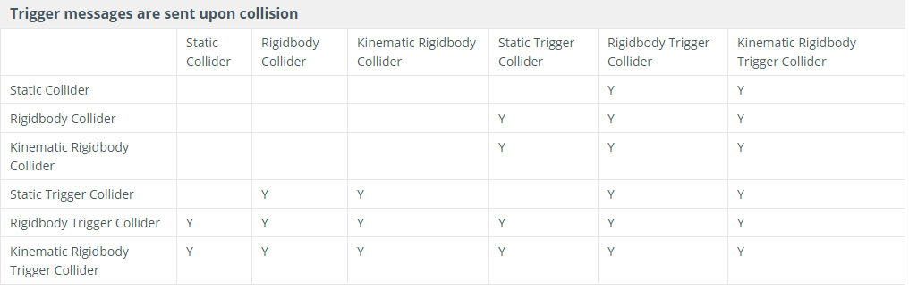

Our hand has no rigidbody (making it static) and has a trigger collider, so it counts as a Static Trigger Collider. By the chart, it’ll send trigger messages upon colliding with our gun, which is a Rigidbody Collider.

So now we have a function that gets called when we touch the gun. However, this function could get called when it collides with other things as well, so we need a way to identify whether parameter other is actually the collider attached to our gun. We’ll use [**tags**](https://docs.unity3d.com/Manual/Tags.html) to do so.

    void OnTriggerStay(Collider other) {
        if (other.CompareTag("Gun")) {

        }
    }

Now that we know we’re dealing with a gun, let’s check if requirements two and three are met by checking if the Interactor has a grab selection (if the gun is grabbed by the interactor). If they are, we can certify we can grab the gun via a script! You might want to comment out or delete the Debug.Log statements in Update() so that your Log message can be seen clearly.

    void OnTriggerStay(Collider other)
    {
        if (other.CompareTag("Gun"))
        {
            if (interactor.hasSelection) {
                print("Grabbing gun.");
            }
        }
    }

Our code is now ready to test, but there’s one thing we need to do in Unity first: set the tag on the gun. Select your Gun object in the hierarchy, and in the Inspector view go to Tag > Add Tag. Press the plus button and create a new tag called “Gun”. Then select your Gun again and tag it as “Gun”.

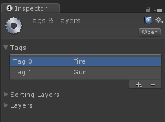

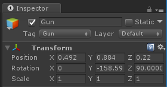

Try it out! Stick your hand into the gun and hold down the grab trigger, and check that you’re repeatedly printing out “Grabbing gun.” when you do so. Now with this verified via script, we can now access the exact Gun's GameObject through the other collider passed through OnTriggerStay.

*Note: This exercise doesn't actually need the OnTriggerStay since we can verify grabbing and also access the gun through the XR Interactor. We found it necessary to practice the trigger collider system since it is ubiquitous in Unity development.*

# Firing the Gun (Part 2)

We’ve finally reached the most exciting part of the lab: firing the gun. As always, let’s first consider the requirements that need to be met for the gun to fire:

1. We must be holding the gun.

2. We must press down on the index trigger
   
   - But it shouldn’t constantly fire as we hold it down.

We’re already checking for item 1 when OnTriggerStay is called, so let us read the trigger value here.

    void Update() {

    }
    void OnTriggerStay(Collider other)
    {
        if (other.CompareTag("Gun"))
        {
            if (interactor.hasSelection)
            {
                float trigger = controllerActionTrigger.action.ReadValue<float>();
                Debug.Log("Grabbing gun.");
                Debug.Log("Trigger value: " + trigger);
            }
            
        }
    }

When we build, we can see that the trigger value can either be a 1 or a 0. Since we should not be able to hold the trigger and keep firing, we need to wait until the trigger value reaches 0 before firing again. Let's save the trigger value for each frame to reference and overwrite in the next with a float prevTrigger:

    public class Hand : MonoBehaviour {

        [SerializeField] public InputActionReference controllerActionTrigger;
        private GameObject gun = null;
        private XRDirectInteractor interactor;
        private float prevTrigger = 0f;
        ...

    void OnTriggerStay(Collider other)
    {
        if (other.CompareTag("Gun"))
        {
            if (interactor.hasSelection)
            {
                float trigger = controllerActionTrigger.action.ReadValue<float>();
                Debug.Log("Grabbing gun.");
                if (trigger != 0 && prevTrigger == 0)
                {
                    Debug.Log("Fire!");
                }
                prevTrigger = trigger;
            } 
        }
    }

Ok we can now verify we can hold the trigger and we only fire once! 

But right now, the script only calls functions inside the controller GameObject. Since we can access the Gun GameObject with the interactors, let us first make a new C# script with the name "**Gun**" with a single public function Fire().

    using UnityEngine;
    public class Gun : MonoBehaviour
    {
        public void Fire()
        {
            Debug.Log("Pew");
        }
    }

To call this function from the Hand script, we need to obtain the GameObject inside OnTriggerStay. We know that the collider's GameObject is the Gun, so:

    void OnTriggerStay(Collider other)
    {
        if (other.CompareTag("Gun"))
        {
            if (interactor.hasSelection)
            {
                float trigger = controllerActionTrigger.action.ReadValue<float>();
                Debug.Log("Grabbing gun.");
                if (trigger != 0 && prevTrigger == 0)
                {
                    other.gameObject.GetComponent<Gun>().Fire();
                }
                prevTrigger = trigger;
            }
        }
    }

If you try the project now, you should be able to print “Pew!” by pressing the index trigger.

The only thing left is to replace this print statement with proper behaviour. Let’s list out all the things that need to happen when we fire the gun:

- Gunshot sound plays.

- Recoil animation plays.

- Gunshot explosion visual effect (VFX) plays.

All three of these things will require use of different Unity components.

# Sound

In Unity, add an AudioSource component to gameobject Gun. AudioSources are what play sounds in Unity. Turn off “Play On Awake” since we don’t want to hear a gunshot every time we start the game. Then assign the clip “Gunshot” to the Audio Clip field (you can either drag it in from the Sounds folder or click the circle on the right).

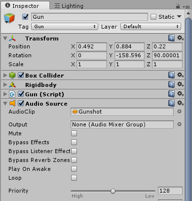

Next in Gun.cs, create a private variable of type AudioSource called audioSource. Then in Start(), initialize that value to reference the component we just created.

    public class Gun : MonoBehaviour {
        ...

        AudioSource audioSource;

        // Use this for initialization
        void Start () {
            audioSource = GetComponent<AudioSource>();
        }

    ...

Now that we have a reference to the component, we can use it in our Fire() function. To play the clip attached to an AudioSource, call audioSource.PlayOneShot(). Unity also has a function called audioSource.Play(), but it can’t play multiple sounds simultaneously. This would be problematic as we can fire the gun faster than the length of the gunshot clip.

    public void Fire() {
        audioSource.PlayOneShot(audioSource.clip);
    }

Firing the gun now should give you a satisfying sound effect.

# Animation

We won’t be getting into the details of animation in this class. If you wish to learn more about it, I recommend first going through some of Unity’s videos on the topic [**here**](https://unity3d.com/learn/tutorials/topics/animation). Instead I’ll give a quick overview of the system. **This is optional: if you wish to skip this part and go straight to the next instruction, just look for the next bolded sentence.**

On a high level, Unity’s animation system consists of two parts: controllers and motions. Motions (also called animations) are pieces of data that show how a particular object changes over time; they’re made in either Unity or some other software like Maya or 3DS Max. Controllers, on the other hand, are animation state machines; they contain the logic that dictates what animation plays when, based off of a set of external flags called parameters.

Parameters are defined in the controller and can be accessed/modified via script. This is mostly how we’ll be interacting with the animation system during the labs.

Take a look at the Animations folder and double-click the “Gun” controller to open up the Animator window.

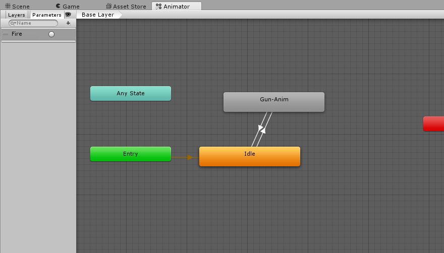

Note there are only two “real” states that are connected, Idle and Gun-Anim, and if you click on the Idle state you’ll see it doesn’t have a motion attached in the inspector. The Gun-Anim state does, however: the recoil animation. The green “Entry” state points to what state we start off on.

Next, look at the arrow going from Idle to Gun-Anim. This is a transition, and tells us that our Gun could possibly move from the Idle to Gun-Anim state.

In the inspector, you’ll see a box labeled “Conditions”. Conditions list out all the parameter requirements that need to be met for a transition to be taken. This box contains only a single parameter: “Fire”. You can view all possible parameters by clicking the word “Parameters” on the left side of the window.

The open circle next to the Fire parameter indicates that parameter Fire is a trigger type parameter. When it gets set to true (via script or some other means), it’ll stay true for one frame and then automatically set itself to false again. There are other types of parameters too, such as int, float, or bool.

What this means is that if our Gun is in the Idle state and we set the Fire parameter to true, it’ll move to the Gun-Anim state and start playing the motion stored there (the recoil animation).

If you now click on the arrow going from Gun-Anim to Idle, you’ll notice there’s no conditions listed. Does this mean we’re stuck in the state once we get there? Not quite. The checked box “Has Exit Time” above tells Unity that when the motion in the starting state is finished, it should automatically take this arrow. So no other condition is needed to return to Idle.

Let’s put all of this together now. Our gun starts off in the Idle state, and when we set parameter Fire to true, it moves to the Gun-Anim state and plays the recoil animation. Once the recoil animation is finished, it automatically moves back to the Idle state.

**The optional section ends here**. First off, add an Animator component to Gun’s child, Model, and set its controller to Gun (you could also just drag Gun.controller in the animations folder into Model’s inspector view). The animator must go on Model since that’s the 3D model that actually gets animated.

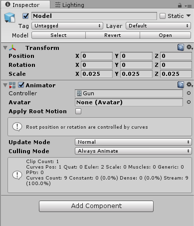

Now in order to start the recoil animation, we need to set the “Fire” parameter in the Animator component, which we can do in code. Switch to editing Gun.cs. We’ll start off by creating a private variable that holds our animator and initializing it in Start(). Since our animator component is on Model, not Gun, we’ll need to get a reference to Model. transform.Find() looks for a specifically named object in all of the base object’s children.

        ...

        private AudioSource audioSource;
        private Animator animator;

        // Use this for initialization
        void Start () {
            audioSource = GetComponent<AudioSource>();
            animator = transform.Find("Model").GetComponent<Animator>();
        }

        ...

Then in our Fire() function, we’ll set the parameter to trigger the animation. Unity’s Animator class has a different set function for each parameter type. In this case, we’re setting a trigger type parameter so we’ll use SetTrigger() and feed it the name of the parameter we want set.

public void Fire() {
    audioSource.PlayOneShot(audioSource.clip);
    animator.SetTrigger("Fire");
}

Firing the gun now should play a short recoil animation.

# Visual Effect

Just like with animation, Unity has its own complex system for creating and manipulating visual effects that won’t be in scope for this class. If you wish to learn more about it, I recommend starting with Unity’s [video](https://unity3d.com/learn/tutorials/topics/graphics/particle-system) on the topic.

In folder Prefabs/Particle Systems, we’ve provided a gunshot VFX for you called “MuzzleFlashEffect”. Drag it into the editor as a child of Gun. It should already be positioned correctly in front of the gun barrel (where the VFX will play). If not, change its transform to what’s shown below.

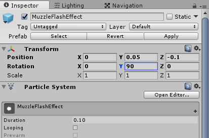

All that’s left is to play the VFX here in script. Switch to editing Gun.cs. Like the previous two sections, we’ll start by creating and initializing a variable that’ll reference the Particle System.

        ...

        private AudioSource audioSource;
        private Animator animator;
        private ParticleSystem particleSystem;

        // Use this for initialization
        void Start () {
            audioSource = GetComponent<AudioSource>();
            animator = transform.Find("Model").GetComponent<Animator>();
            particleSystem = transform.Find("MuzzleFlashEffect").GetComponent<ParticleSystem>();
        }

        ...

Then in our function Fire() we’ll make the VFX play.

    public void Fire() {
        audioSource.PlayOneShot(audioSource.clip);
        animator.SetTrigger("Fire");
        particleSystem.Play();
    }

Firing the gun should now create a spark of muzzle flash at the front of the gun.

# Check Off

*This marks the end of lab 2! To check-off successfully, let a facilitator see your current project and show them that you can pick up, drop/throw, and fire the gun properly.*